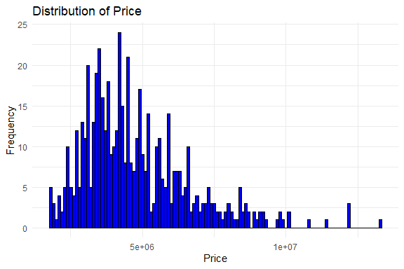
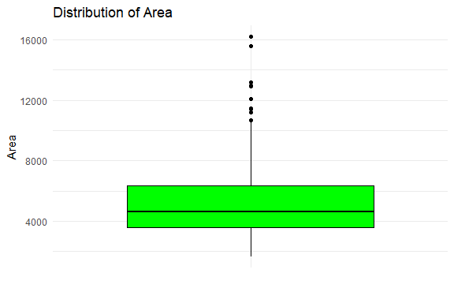
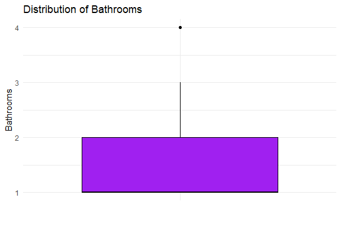
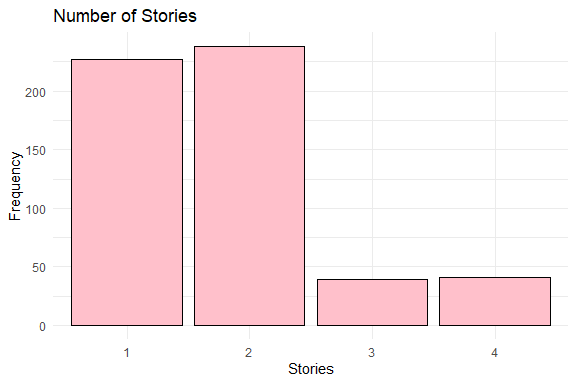
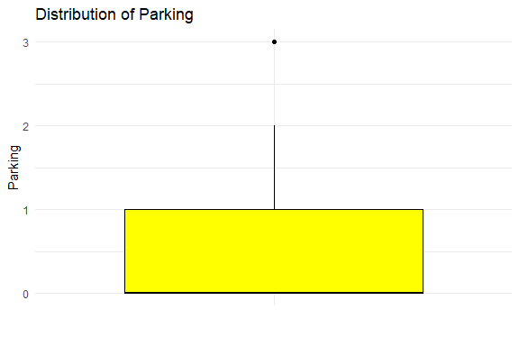
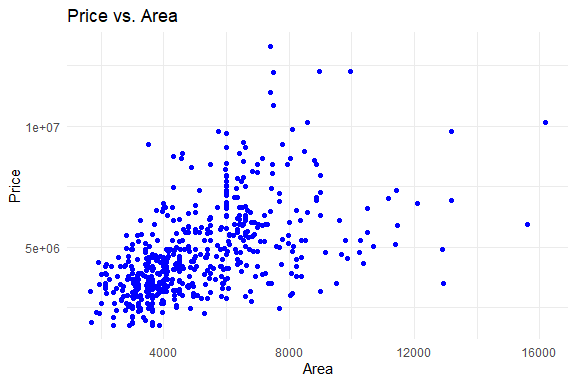
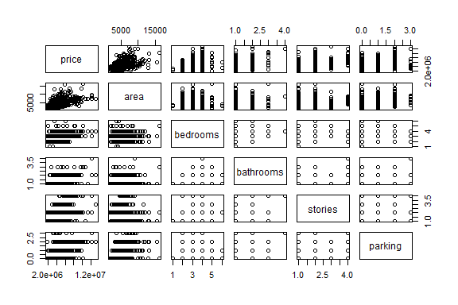
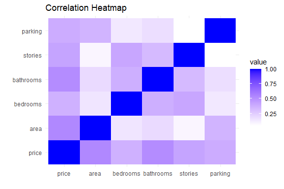

Housing Prices Prediction
================
Trevor Okinda
2024

- [Student Details](#student-details)
- [Setup Chunk](#setup-chunk)
  - [Source:](#source)
  - [Reference:](#reference)
- [Exploratory Data Analysis](#exploratory-data-analysis)
  - [Load dataset](#load-dataset)
  - [Measures of Frequency](#measures-of-frequency)
  - [Measures of Central Tendency](#measures-of-central-tendency)
  - [Measures of Distribution](#measures-of-distribution)
  - [Measures of Relationship](#measures-of-relationship)
  - [ANOVA](#anova)
  - [Plots](#plots)

# Student Details

|                       |                           |
|-----------------------|---------------------------|
| **Student ID Number** | 134780                    |
| **Student Name**      | Trevor Okinda             |
| **BBIT 4.2 Group**    | C                         |
| **Project Name**      | Housing Prices Prediction |

# Setup Chunk

**Note:** the following KnitR options have been set as the global
defaults: <BR>
`knitr::opts_chunk$set(echo = TRUE, warning = FALSE, eval = TRUE, collapse = FALSE, tidy = TRUE)`.

More KnitR options are documented here
<https://bookdown.org/yihui/rmarkdown-cookbook/chunk-options.html> and
here <https://yihui.org/knitr/options/>.

### Source:

The dataset that was used can be downloaded here: *\<<a
href="https://www.kaggle.com/datasets/yasserh/housing-prices-dataset\"
class="uri">https://www.kaggle.com/datasets/yasserh/housing-prices-dataset\</a>\>*

### Reference:

*\<Harrison, D., & Rubinfeld, D. L. (1978). Hedonic prices and the
demand for clean air. Journal of Environmental Economics and Management,
5(1), 81–102. Belsley, D. A., Kuh, E., & Welsch, R. E. (1980).
Regression Diagnostics: Identifying Influential Data and Sources of
Collinearity. New York: Wiley\>  
Refer to the APA 7th edition manual for rules on how to cite datasets:
<https://apastyle.apa.org/style-grammar-guidelines/references/examples/data-set-references>*

# Exploratory Data Analysis

## Load dataset

``` r
# Load dataset
housing_data <- read.csv("Housing.csv", colClasses = c(
  price = "numeric",
  area = "integer",
  bedrooms = "numeric",
  bathrooms = "numeric",
  stories = "numeric",
  mainroad = "factor",
  guestroom = "factor",
  basement = "factor",
  hotwaterheating = "factor",
  airconditioning = "factor",
  parking = "numeric",
  prefarea = "factor",
  furnishingstatus = "factor"
))

# Display the structure of the dataset
str(housing_data)
```

    ## 'data.frame':    545 obs. of  13 variables:
    ##  $ price           : num  13300000 12250000 12250000 12215000 11410000 ...
    ##  $ area            : int  7420 8960 9960 7500 7420 7500 8580 16200 8100 5750 ...
    ##  $ bedrooms        : num  4 4 3 4 4 3 4 5 4 3 ...
    ##  $ bathrooms       : num  2 4 2 2 1 3 3 3 1 2 ...
    ##  $ stories         : num  3 4 2 2 2 1 4 2 2 4 ...
    ##  $ mainroad        : Factor w/ 2 levels "no","yes": 2 2 2 2 2 2 2 2 2 2 ...
    ##  $ guestroom       : Factor w/ 2 levels "no","yes": 1 1 1 1 2 1 1 1 2 2 ...
    ##  $ basement        : Factor w/ 2 levels "no","yes": 1 1 2 2 2 2 1 1 2 1 ...
    ##  $ hotwaterheating : Factor w/ 2 levels "no","yes": 1 1 1 1 1 1 1 1 1 1 ...
    ##  $ airconditioning : Factor w/ 2 levels "no","yes": 2 2 1 2 2 2 2 1 2 2 ...
    ##  $ parking         : num  2 3 2 3 2 2 2 0 2 1 ...
    ##  $ prefarea        : Factor w/ 2 levels "no","yes": 2 1 2 2 1 2 2 1 2 2 ...
    ##  $ furnishingstatus: Factor w/ 3 levels "furnished","semi-furnished",..: 1 1 2 1 1 2 2 3 1 3 ...

``` r
# View the first few rows of the dataset
head(housing_data)
```

    ##      price area bedrooms bathrooms stories mainroad guestroom basement
    ## 1 13300000 7420        4         2       3      yes        no       no
    ## 2 12250000 8960        4         4       4      yes        no       no
    ## 3 12250000 9960        3         2       2      yes        no      yes
    ## 4 12215000 7500        4         2       2      yes        no      yes
    ## 5 11410000 7420        4         1       2      yes       yes      yes
    ## 6 10850000 7500        3         3       1      yes        no      yes
    ##   hotwaterheating airconditioning parking prefarea furnishingstatus
    ## 1              no             yes       2      yes        furnished
    ## 2              no             yes       3       no        furnished
    ## 3              no              no       2      yes   semi-furnished
    ## 4              no             yes       3      yes        furnished
    ## 5              no             yes       2       no        furnished
    ## 6              no             yes       2      yes   semi-furnished

``` r
# View the dataset in a separate viewer window
View(housing_data)
```

## Measures of Frequency

``` r
# Measures of frequency for categorical variables
table_mainroad <- table(housing_data$mainroad)
table_guestroom <- table(housing_data$guestroom)
table_basement <- table(housing_data$basement)
table_hotwater <- table(housing_data$hotwaterheating)
table_airconditioning <- table(housing_data$airconditioning)
table_prefarea <- table(housing_data$prefarea)
table_furnishingstatus <- table(housing_data$furnishingstatus)

# Display measures of frequency
print("Frequency of Mainroad:")
```

    ## [1] "Frequency of Mainroad:"

``` r
print(table_mainroad)
```

    ## 
    ##  no yes 
    ##  77 468

``` r
print("Frequency of Guestroom:")
```

    ## [1] "Frequency of Guestroom:"

``` r
print(table_guestroom)
```

    ## 
    ##  no yes 
    ## 448  97

``` r
print("Frequency of Basement:")
```

    ## [1] "Frequency of Basement:"

``` r
print(table_basement)
```

    ## 
    ##  no yes 
    ## 354 191

``` r
print("Frequency of Hot Water Heating:")
```

    ## [1] "Frequency of Hot Water Heating:"

``` r
print(table_hotwater)
```

    ## 
    ##  no yes 
    ## 520  25

``` r
print("Frequency of Air Conditioning:")
```

    ## [1] "Frequency of Air Conditioning:"

``` r
print(table_airconditioning)
```

    ## 
    ##  no yes 
    ## 373 172

``` r
print("Frequency of Preferred Area:")
```

    ## [1] "Frequency of Preferred Area:"

``` r
print(table_prefarea)
```

    ## 
    ##  no yes 
    ## 417 128

``` r
print("Frequency of Furnishing Status:")
```

    ## [1] "Frequency of Furnishing Status:"

``` r
print(table_furnishingstatus)
```

    ## 
    ##      furnished semi-furnished    unfurnished 
    ##            140            227            178

## Measures of Central Tendency

``` r
# Measures of central tendency for numerical variables
mean_price <- mean(housing_data$price)
median_price <- median(housing_data$price)
mean_area <- mean(housing_data$area)
median_area <- median(housing_data$area)
mean_bedrooms <- mean(housing_data$bedrooms)
median_bedrooms <- median(housing_data$bedrooms)
mean_bathrooms <- mean(housing_data$bathrooms)
median_bathrooms <- median(housing_data$bathrooms)
mean_stories <- mean(housing_data$stories)
median_stories <- median(housing_data$stories)
mean_parking <- mean(housing_data$parking)
median_parking <- median(housing_data$parking)

# Display measures of central tendency
print("Measures of Central Tendency:")
```

    ## [1] "Measures of Central Tendency:"

``` r
print(paste("Mean Price:", mean_price))
```

    ## [1] "Mean Price: 4766729.24770642"

``` r
print(paste("Median Price:", median_price))
```

    ## [1] "Median Price: 4340000"

``` r
print(paste("Mean Area:", mean_area))
```

    ## [1] "Mean Area: 5150.54128440367"

``` r
print(paste("Median Area:", median_area))
```

    ## [1] "Median Area: 4600"

``` r
print(paste("Mean Bedrooms:", mean_bedrooms))
```

    ## [1] "Mean Bedrooms: 2.9651376146789"

``` r
print(paste("Median Bedrooms:", median_bedrooms))
```

    ## [1] "Median Bedrooms: 3"

``` r
print(paste("Mean Bathrooms:", mean_bathrooms))
```

    ## [1] "Mean Bathrooms: 1.28623853211009"

``` r
print(paste("Median Bathrooms:", median_bathrooms))
```

    ## [1] "Median Bathrooms: 1"

``` r
print(paste("Mean Stories:", mean_stories))
```

    ## [1] "Mean Stories: 1.80550458715596"

``` r
print(paste("Median Stories:", median_stories))
```

    ## [1] "Median Stories: 2"

``` r
print(paste("Mean Parking:", mean_parking))
```

    ## [1] "Mean Parking: 0.693577981651376"

``` r
print(paste("Median Parking:", median_parking))
```

    ## [1] "Median Parking: 0"

## Measures of Distribution

``` r
# Measures of distribution for numerical variables
range_price <- range(housing_data$price)
range_area <- range(housing_data$area)
range_bedrooms <- range(housing_data$bedrooms)
range_bathrooms <- range(housing_data$bathrooms)
range_stories <- range(housing_data$stories)
range_parking <- range(housing_data$parking)

variance_price <- var(housing_data$price)
variance_area <- var(housing_data$area)
variance_bedrooms <- var(housing_data$bedrooms)
variance_bathrooms <- var(housing_data$bathrooms)
variance_stories <- var(housing_data$stories)
variance_parking <- var(housing_data$parking)

std_dev_price <- sd(housing_data$price)
std_dev_area <- sd(housing_data$area)
std_dev_bedrooms <- sd(housing_data$bedrooms)
std_dev_bathrooms <- sd(housing_data$bathrooms)
std_dev_stories <- sd(housing_data$stories)
std_dev_parking <- sd(housing_data$parking)

# Display measures of distribution
print("Measures of Distribution:")
```

    ## [1] "Measures of Distribution:"

``` r
print(paste("Price Range:", range_price))
```

    ## [1] "Price Range: 1750000"  "Price Range: 13300000"

``` r
print(paste("Area Range:", range_area))
```

    ## [1] "Area Range: 1650"  "Area Range: 16200"

``` r
print(paste("Bedrooms Range:", range_bedrooms))
```

    ## [1] "Bedrooms Range: 1" "Bedrooms Range: 6"

``` r
print(paste("Bathrooms Range:", range_bathrooms))
```

    ## [1] "Bathrooms Range: 1" "Bathrooms Range: 4"

``` r
print(paste("Stories Range:", range_stories))
```

    ## [1] "Stories Range: 1" "Stories Range: 4"

``` r
print(paste("Parking Range:", range_parking))
```

    ## [1] "Parking Range: 0" "Parking Range: 3"

``` r
print(paste("Price Variance:", variance_price))
```

    ## [1] "Price Variance: 3498544355820.57"

``` r
print(paste("Area Variance:", variance_area))
```

    ## [1] "Area Variance: 4709512.05757555"

``` r
print(paste("Bedrooms Variance:", variance_bedrooms))
```

    ## [1] "Bedrooms Variance: 0.544738262277388"

``` r
print(paste("Bathrooms Variance:", variance_bathrooms))
```

    ## [1] "Bathrooms Variance: 0.252475715056665"

``` r
print(paste("Stories Variance:", variance_stories))
```

    ## [1] "Stories Variance: 0.752543173232596"

``` r
print(paste("Parking Variance:", variance_parking))
```

    ## [1] "Parking Variance: 0.742330005396654"

``` r
print(paste("Price Standard Deviation:", std_dev_price))
```

    ## [1] "Price Standard Deviation: 1870439.61565739"

``` r
print(paste("Area Standard Deviation:", std_dev_area))
```

    ## [1] "Area Standard Deviation: 2170.1410225088"

``` r
print(paste("Bedrooms Standard Deviation:", std_dev_bedrooms))
```

    ## [1] "Bedrooms Standard Deviation: 0.738063860568574"

``` r
print(paste("Bathrooms Standard Deviation:", std_dev_bathrooms))
```

    ## [1] "Bathrooms Standard Deviation: 0.502469616053215"

``` r
print(paste("Stories Standard Deviation:", std_dev_stories))
```

    ## [1] "Stories Standard Deviation: 0.867492462925526"

``` r
print(paste("Parking Standard Deviation:", std_dev_parking))
```

    ## [1] "Parking Standard Deviation: 0.861585750460541"

## Measures of Relationship

``` r
# Compute correlation coefficients
correlation_matrix <- cor(housing_data[c("price", "area", "bedrooms", "bathrooms", "stories", "parking")])

# Display correlation matrix
print("Correlation Matrix:")
```

    ## [1] "Correlation Matrix:"

``` r
print(correlation_matrix)
```

    ##               price       area  bedrooms bathrooms    stories    parking
    ## price     1.0000000 0.53599735 0.3664940 0.5175453 0.42071237 0.38439365
    ## area      0.5359973 1.00000000 0.1518585 0.1938195 0.08399605 0.35298048
    ## bedrooms  0.3664940 0.15185849 1.0000000 0.3739302 0.40856424 0.13926990
    ## bathrooms 0.5175453 0.19381953 0.3739302 1.0000000 0.32616471 0.17749582
    ## stories   0.4207124 0.08399605 0.4085642 0.3261647 1.00000000 0.04554709
    ## parking   0.3843936 0.35298048 0.1392699 0.1774958 0.04554709 1.00000000

## ANOVA

``` r
# Perform ANOVA
anova_result <- aov(price ~ furnishingstatus, data = housing_data)

# Summarize ANOVA results
summary(anova_result)
```

    ##                   Df    Sum Sq  Mean Sq F value   Pr(>F)    
    ## furnishingstatus   2 1.798e+14 8.99e+13   28.27 2.09e-12 ***
    ## Residuals        542 1.723e+15 3.18e+12                     
    ## ---
    ## Signif. codes:  0 '***' 0.001 '**' 0.01 '*' 0.05 '.' 0.1 ' ' 1

## Plots

``` r
# Load necessary library
library(ggplot2)
library(reshape2)

# Histogram for price
ggplot(housing_data, aes(x = price)) +
  geom_histogram(binwidth = 100000, fill = "blue", color = "black") +
  labs(title = "Distribution of Price", x = "Price", y = "Frequency") +
  theme_minimal()
```

<!-- -->

``` r
# Boxplot for area
ggplot(housing_data, aes(x = "", y = area)) +
  geom_boxplot(fill = "green", color = "black") +
  labs(title = "Distribution of Area", x = "", y = "Area") +
  theme_minimal()
```

<!-- -->

``` r
# Barplot for bedrooms
ggplot(housing_data, aes(x = as.factor(bedrooms))) +
  geom_bar(fill = "orange", color = "black") +
  labs(title = "Number of Bedrooms", x = "Bedrooms", y = "Frequency") +
  theme_minimal()
```

<!-- -->

``` r
# Boxplot for bathrooms
ggplot(housing_data, aes(x = "", y = bathrooms)) +
  geom_boxplot(fill = "purple", color = "black") +
  labs(title = "Distribution of Bathrooms", x = "", y = "Bathrooms") +
  theme_minimal()
```

<!-- -->

``` r
# Histogram for stories
ggplot(housing_data, aes(x = as.factor(stories))) +
  geom_bar(fill = "pink", color = "black") +
  labs(title = "Number of Stories", x = "Stories", y = "Frequency") +
  theme_minimal()
```

<!-- -->

``` r
# Boxplot for parking
ggplot(housing_data, aes(x = "", y = parking)) +
  geom_boxplot(fill = "yellow", color = "black") +
  labs(title = "Distribution of Parking", x = "", y = "Parking") +
  theme_minimal()
```

<!-- -->

``` r
# Scatter plot: price vs. area
ggplot(housing_data, aes(x = area, y = price)) +
  geom_point(color = "blue") +
  labs(title = "Price vs. Area", x = "Area", y = "Price") +
  theme_minimal()
```

<!-- -->

``` r
# Pair plot for numerical variables
pair_data <- housing_data[, c("price", "area", "bedrooms", "bathrooms", "stories", "parking")]
pairs(pair_data)
```

<!-- -->

``` r
# Heatmap for correlation matrix
correlation_matrix <- cor(housing_data[c("price", "area", "bedrooms", "bathrooms", "stories", "parking")])
ggplot(data = melt(correlation_matrix), aes(x = Var1, y = Var2, fill = value)) +
  geom_tile() +
  scale_fill_gradient(low = "white", high = "blue") +
  labs(title = "Correlation Heatmap", x = "", y = "") +
  theme_minimal()
```

<!-- -->
