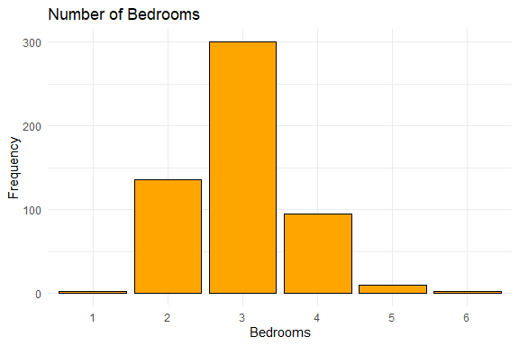

Housing Prices Prediction
================
Trevor Okinda
2024

- [Student Details](#student-details)
- [Setup Chunk](#setup-chunk)
  - [Source:](#source)
  - [Reference:](#reference)
- [Exploratory Data Analysis](#exploratory-data-analysis)
  - [Load dataset](#load-dataset)
  - [Measures of Frequency](#measures-of-frequency)
  - [Measures of Central Tendency](#measures-of-central-tendency)
  - [Measures of Distribution](#measures-of-distribution)
  - [Measures of Relationship](#measures-of-relationship)
  - [ANOVA](#anova)
  - [Plots](#plots)
- [Preprocessing and Data
  Transformation](#preprocessing-and-data-transformation)
  - [Missing Values](#missing-values)
- [Training Model](#training-model)
  - [Data Splitting](#data-splitting)
  - [Bootstrapping](#bootstrapping)
  - [Cross-validation](#cross-validation)
  - [Train different models](#train-different-models)
  - [Performance Comparison](#performance-comparison)
  - [Saving Model](#saving-model)

# Student Details

|                       |                           |
|-----------------------|---------------------------|
| **Student ID Number** | 134780                    |
| **Student Name**      | Trevor Okinda             |
| **BBIT 4.2 Group**    | C                         |
| **Project Name**      | Housing Prices Prediction |

# Setup Chunk

**Note:** the following KnitR options have been set as the global
defaults: <BR>
`knitr::opts_chunk$set(echo = TRUE, warning = FALSE, eval = TRUE, collapse = FALSE, tidy = TRUE)`.

More KnitR options are documented here
<https://bookdown.org/yihui/rmarkdown-cookbook/chunk-options.html> and
here <https://yihui.org/knitr/options/>.

### Source:

The dataset that was used can be downloaded here: *\<<a
href="https://www.kaggle.com/datasets/yasserh/housing-prices-dataset\"
class="uri">https://www.kaggle.com/datasets/yasserh/housing-prices-dataset\</a>\>*

### Reference:

*\<Harrison, D., & Rubinfeld, D. L. (1978). Hedonic prices and the
demand for clean air. Journal of Environmental Economics and Management,
5(1), 81–102. Belsley, D. A., Kuh, E., & Welsch, R. E. (1980).
Regression Diagnostics: Identifying Influential Data and Sources of
Collinearity. New York: Wiley\>  
Refer to the APA 7th edition manual for rules on how to cite datasets:
<https://apastyle.apa.org/style-grammar-guidelines/references/examples/data-set-references>*

# Exploratory Data Analysis

## Load dataset

``` r
# Load dataset
housing_data <- read.csv("Housing.csv", colClasses = c(
  price = "numeric",
  area = "integer",
  bedrooms = "numeric",
  bathrooms = "numeric",
  stories = "numeric",
  mainroad = "factor",
  guestroom = "factor",
  basement = "factor",
  hotwaterheating = "factor",
  airconditioning = "factor",
  parking = "numeric",
  prefarea = "factor",
  furnishingstatus = "factor"
))

# Display the structure of the dataset
str(housing_data)
```

    ## 'data.frame':    545 obs. of  13 variables:
    ##  $ price           : num  13300000 12250000 12250000 12215000 11410000 ...
    ##  $ area            : int  7420 8960 9960 7500 7420 7500 8580 16200 8100 5750 ...
    ##  $ bedrooms        : num  4 4 3 4 4 3 4 5 4 3 ...
    ##  $ bathrooms       : num  2 4 2 2 1 3 3 3 1 2 ...
    ##  $ stories         : num  3 4 2 2 2 1 4 2 2 4 ...
    ##  $ mainroad        : Factor w/ 2 levels "no","yes": 2 2 2 2 2 2 2 2 2 2 ...
    ##  $ guestroom       : Factor w/ 2 levels "no","yes": 1 1 1 1 2 1 1 1 2 2 ...
    ##  $ basement        : Factor w/ 2 levels "no","yes": 1 1 2 2 2 2 1 1 2 1 ...
    ##  $ hotwaterheating : Factor w/ 2 levels "no","yes": 1 1 1 1 1 1 1 1 1 1 ...
    ##  $ airconditioning : Factor w/ 2 levels "no","yes": 2 2 1 2 2 2 2 1 2 2 ...
    ##  $ parking         : num  2 3 2 3 2 2 2 0 2 1 ...
    ##  $ prefarea        : Factor w/ 2 levels "no","yes": 2 1 2 2 1 2 2 1 2 2 ...
    ##  $ furnishingstatus: Factor w/ 3 levels "furnished","semi-furnished",..: 1 1 2 1 1 2 2 3 1 3 ...

``` r
# View the first few rows of the dataset
head(housing_data)
```

    ##      price area bedrooms bathrooms stories mainroad guestroom basement
    ## 1 13300000 7420        4         2       3      yes        no       no
    ## 2 12250000 8960        4         4       4      yes        no       no
    ## 3 12250000 9960        3         2       2      yes        no      yes
    ## 4 12215000 7500        4         2       2      yes        no      yes
    ## 5 11410000 7420        4         1       2      yes       yes      yes
    ## 6 10850000 7500        3         3       1      yes        no      yes
    ##   hotwaterheating airconditioning parking prefarea furnishingstatus
    ## 1              no             yes       2      yes        furnished
    ## 2              no             yes       3       no        furnished
    ## 3              no              no       2      yes   semi-furnished
    ## 4              no             yes       3      yes        furnished
    ## 5              no             yes       2       no        furnished
    ## 6              no             yes       2      yes   semi-furnished

``` r
# View the dataset in a separate viewer window
View(housing_data)
```

## Measures of Frequency

``` r
# Measures of frequency for categorical variables
table_mainroad <- table(housing_data$mainroad)
table_guestroom <- table(housing_data$guestroom)
table_basement <- table(housing_data$basement)
table_hotwater <- table(housing_data$hotwaterheating)
table_airconditioning <- table(housing_data$airconditioning)
table_prefarea <- table(housing_data$prefarea)
table_furnishingstatus <- table(housing_data$furnishingstatus)

# Display measures of frequency
print("Frequency of Mainroad:")
```

    ## [1] "Frequency of Mainroad:"

``` r
print(table_mainroad)
```

    ## 
    ##  no yes 
    ##  77 468

``` r
print("Frequency of Guestroom:")
```

    ## [1] "Frequency of Guestroom:"

``` r
print(table_guestroom)
```

    ## 
    ##  no yes 
    ## 448  97

``` r
print("Frequency of Basement:")
```

    ## [1] "Frequency of Basement:"

``` r
print(table_basement)
```

    ## 
    ##  no yes 
    ## 354 191

``` r
print("Frequency of Hot Water Heating:")
```

    ## [1] "Frequency of Hot Water Heating:"

``` r
print(table_hotwater)
```

    ## 
    ##  no yes 
    ## 520  25

``` r
print("Frequency of Air Conditioning:")
```

    ## [1] "Frequency of Air Conditioning:"

``` r
print(table_airconditioning)
```

    ## 
    ##  no yes 
    ## 373 172

``` r
print("Frequency of Preferred Area:")
```

    ## [1] "Frequency of Preferred Area:"

``` r
print(table_prefarea)
```

    ## 
    ##  no yes 
    ## 417 128

``` r
print("Frequency of Furnishing Status:")
```

    ## [1] "Frequency of Furnishing Status:"

``` r
print(table_furnishingstatus)
```

    ## 
    ##      furnished semi-furnished    unfurnished 
    ##            140            227            178

## Measures of Central Tendency

``` r
# Measures of central tendency for numerical variables
mean_price <- mean(housing_data$price)
median_price <- median(housing_data$price)
mean_area <- mean(housing_data$area)
median_area <- median(housing_data$area)
mean_bedrooms <- mean(housing_data$bedrooms)
median_bedrooms <- median(housing_data$bedrooms)
mean_bathrooms <- mean(housing_data$bathrooms)
median_bathrooms <- median(housing_data$bathrooms)
mean_stories <- mean(housing_data$stories)
median_stories <- median(housing_data$stories)
mean_parking <- mean(housing_data$parking)
median_parking <- median(housing_data$parking)

# Display measures of central tendency
print("Measures of Central Tendency:")
```

    ## [1] "Measures of Central Tendency:"

``` r
print(paste("Mean Price:", mean_price))
```

    ## [1] "Mean Price: 4766729.24770642"

``` r
print(paste("Median Price:", median_price))
```

    ## [1] "Median Price: 4340000"

``` r
print(paste("Mean Area:", mean_area))
```

    ## [1] "Mean Area: 5150.54128440367"

``` r
print(paste("Median Area:", median_area))
```

    ## [1] "Median Area: 4600"

``` r
print(paste("Mean Bedrooms:", mean_bedrooms))
```

    ## [1] "Mean Bedrooms: 2.9651376146789"

``` r
print(paste("Median Bedrooms:", median_bedrooms))
```

    ## [1] "Median Bedrooms: 3"

``` r
print(paste("Mean Bathrooms:", mean_bathrooms))
```

    ## [1] "Mean Bathrooms: 1.28623853211009"

``` r
print(paste("Median Bathrooms:", median_bathrooms))
```

    ## [1] "Median Bathrooms: 1"

``` r
print(paste("Mean Stories:", mean_stories))
```

    ## [1] "Mean Stories: 1.80550458715596"

``` r
print(paste("Median Stories:", median_stories))
```

    ## [1] "Median Stories: 2"

``` r
print(paste("Mean Parking:", mean_parking))
```

    ## [1] "Mean Parking: 0.693577981651376"

``` r
print(paste("Median Parking:", median_parking))
```

    ## [1] "Median Parking: 0"

## Measures of Distribution

``` r
# Measures of distribution for numerical variables
range_price <- range(housing_data$price)
range_area <- range(housing_data$area)
range_bedrooms <- range(housing_data$bedrooms)
range_bathrooms <- range(housing_data$bathrooms)
range_stories <- range(housing_data$stories)
range_parking <- range(housing_data$parking)

variance_price <- var(housing_data$price)
variance_area <- var(housing_data$area)
variance_bedrooms <- var(housing_data$bedrooms)
variance_bathrooms <- var(housing_data$bathrooms)
variance_stories <- var(housing_data$stories)
variance_parking <- var(housing_data$parking)

std_dev_price <- sd(housing_data$price)
std_dev_area <- sd(housing_data$area)
std_dev_bedrooms <- sd(housing_data$bedrooms)
std_dev_bathrooms <- sd(housing_data$bathrooms)
std_dev_stories <- sd(housing_data$stories)
std_dev_parking <- sd(housing_data$parking)

# Display measures of distribution
print("Measures of Distribution:")
```

    ## [1] "Measures of Distribution:"

``` r
print(paste("Price Range:", range_price))
```

    ## [1] "Price Range: 1750000"  "Price Range: 13300000"

``` r
print(paste("Area Range:", range_area))
```

    ## [1] "Area Range: 1650"  "Area Range: 16200"

``` r
print(paste("Bedrooms Range:", range_bedrooms))
```

    ## [1] "Bedrooms Range: 1" "Bedrooms Range: 6"

``` r
print(paste("Bathrooms Range:", range_bathrooms))
```

    ## [1] "Bathrooms Range: 1" "Bathrooms Range: 4"

``` r
print(paste("Stories Range:", range_stories))
```

    ## [1] "Stories Range: 1" "Stories Range: 4"

``` r
print(paste("Parking Range:", range_parking))
```

    ## [1] "Parking Range: 0" "Parking Range: 3"

``` r
print(paste("Price Variance:", variance_price))
```

    ## [1] "Price Variance: 3498544355820.57"

``` r
print(paste("Area Variance:", variance_area))
```

    ## [1] "Area Variance: 4709512.05757555"

``` r
print(paste("Bedrooms Variance:", variance_bedrooms))
```

    ## [1] "Bedrooms Variance: 0.544738262277388"

``` r
print(paste("Bathrooms Variance:", variance_bathrooms))
```

    ## [1] "Bathrooms Variance: 0.252475715056665"

``` r
print(paste("Stories Variance:", variance_stories))
```

    ## [1] "Stories Variance: 0.752543173232596"

``` r
print(paste("Parking Variance:", variance_parking))
```

    ## [1] "Parking Variance: 0.742330005396654"

``` r
print(paste("Price Standard Deviation:", std_dev_price))
```

    ## [1] "Price Standard Deviation: 1870439.61565739"

``` r
print(paste("Area Standard Deviation:", std_dev_area))
```

    ## [1] "Area Standard Deviation: 2170.1410225088"

``` r
print(paste("Bedrooms Standard Deviation:", std_dev_bedrooms))
```

    ## [1] "Bedrooms Standard Deviation: 0.738063860568574"

``` r
print(paste("Bathrooms Standard Deviation:", std_dev_bathrooms))
```

    ## [1] "Bathrooms Standard Deviation: 0.502469616053215"

``` r
print(paste("Stories Standard Deviation:", std_dev_stories))
```

    ## [1] "Stories Standard Deviation: 0.867492462925526"

``` r
print(paste("Parking Standard Deviation:", std_dev_parking))
```

    ## [1] "Parking Standard Deviation: 0.861585750460541"

## Measures of Relationship

``` r
# Compute correlation coefficients
correlation_matrix <- cor(housing_data[c("price", "area", "bedrooms", "bathrooms", "stories", "parking")])

# Display correlation matrix
print("Correlation Matrix:")
```

    ## [1] "Correlation Matrix:"

``` r
print(correlation_matrix)
```

    ##               price       area  bedrooms bathrooms    stories    parking
    ## price     1.0000000 0.53599735 0.3664940 0.5175453 0.42071237 0.38439365
    ## area      0.5359973 1.00000000 0.1518585 0.1938195 0.08399605 0.35298048
    ## bedrooms  0.3664940 0.15185849 1.0000000 0.3739302 0.40856424 0.13926990
    ## bathrooms 0.5175453 0.19381953 0.3739302 1.0000000 0.32616471 0.17749582
    ## stories   0.4207124 0.08399605 0.4085642 0.3261647 1.00000000 0.04554709
    ## parking   0.3843936 0.35298048 0.1392699 0.1774958 0.04554709 1.00000000

## ANOVA

``` r
# Perform ANOVA
anova_result <- aov(price ~ furnishingstatus, data = housing_data)

# Summarize ANOVA results
summary(anova_result)
```

    ##                   Df    Sum Sq  Mean Sq F value   Pr(>F)    
    ## furnishingstatus   2 1.798e+14 8.99e+13   28.27 2.09e-12 ***
    ## Residuals        542 1.723e+15 3.18e+12                     
    ## ---
    ## Signif. codes:  0 '***' 0.001 '**' 0.01 '*' 0.05 '.' 0.1 ' ' 1

## Plots

``` r
# Load necessary library
library(ggplot2)
library(reshape2)

# Histogram for price
ggplot(housing_data, aes(x = price)) +
  geom_histogram(binwidth = 100000, fill = "blue", color = "black") +
  labs(title = "Distribution of Price", x = "Price", y = "Frequency") +
  theme_minimal()
```

<!-- -->

``` r
# Boxplot for area
ggplot(housing_data, aes(x = "", y = area)) +
  geom_boxplot(fill = "green", color = "black") +
  labs(title = "Distribution of Area", x = "", y = "Area") +
  theme_minimal()
```

<!-- -->

``` r
# Barplot for bedrooms
ggplot(housing_data, aes(x = as.factor(bedrooms))) +
  geom_bar(fill = "orange", color = "black") +
  labs(title = "Number of Bedrooms", x = "Bedrooms", y = "Frequency") +
  theme_minimal()
```

<!-- -->

``` r
# Boxplot for bathrooms
ggplot(housing_data, aes(x = "", y = bathrooms)) +
  geom_boxplot(fill = "purple", color = "black") +
  labs(title = "Distribution of Bathrooms", x = "", y = "Bathrooms") +
  theme_minimal()
```

<!-- -->

``` r
# Histogram for stories
ggplot(housing_data, aes(x = as.factor(stories))) +
  geom_bar(fill = "pink", color = "black") +
  labs(title = "Number of Stories", x = "Stories", y = "Frequency") +
  theme_minimal()
```

<!-- -->

``` r
# Boxplot for parking
ggplot(housing_data, aes(x = "", y = parking)) +
  geom_boxplot(fill = "yellow", color = "black") +
  labs(title = "Distribution of Parking", x = "", y = "Parking") +
  theme_minimal()
```

<!-- -->

``` r
# Scatter plot: price vs. area
ggplot(housing_data, aes(x = area, y = price)) +
  geom_point(color = "blue") +
  labs(title = "Price vs. Area", x = "Area", y = "Price") +
  theme_minimal()
```

<!-- -->

``` r
# Pair plot for numerical variables
pair_data <- housing_data[, c("price", "area", "bedrooms", "bathrooms", "stories", "parking")]
pairs(pair_data)
```

<!-- -->

``` r
# Heatmap for correlation matrix
correlation_matrix <- cor(housing_data[c("price", "area", "bedrooms", "bathrooms", "stories", "parking")])
ggplot(data = melt(correlation_matrix), aes(x = Var1, y = Var2, fill = value)) +
  geom_tile() +
  scale_fill_gradient(low = "white", high = "blue") +
  labs(title = "Correlation Heatmap", x = "", y = "") +
  theme_minimal()
```

<!-- -->

# Preprocessing and Data Transformation

## Missing Values

``` r
# Check for missing values
missing_values <- sum(is.na(housing_data))

# Display summary of missing values
print(paste("Number of missing values:", missing_values))
```

    ## [1] "Number of missing values: 0"

``` r
# Summary of missing values by column
print(summary(is.na(housing_data)))
```

    ##    price            area          bedrooms       bathrooms      
    ##  Mode :logical   Mode :logical   Mode :logical   Mode :logical  
    ##  FALSE:545       FALSE:545       FALSE:545       FALSE:545      
    ##   stories         mainroad       guestroom        basement      
    ##  Mode :logical   Mode :logical   Mode :logical   Mode :logical  
    ##  FALSE:545       FALSE:545       FALSE:545       FALSE:545      
    ##  hotwaterheating airconditioning  parking         prefarea      
    ##  Mode :logical   Mode :logical   Mode :logical   Mode :logical  
    ##  FALSE:545       FALSE:545       FALSE:545       FALSE:545      
    ##  furnishingstatus
    ##  Mode :logical   
    ##  FALSE:545

# Training Model

## Data Splitting

``` r
# Load necessary libraries
library(caret)
```

    ## Loading required package: lattice

``` r
# Set seed for reproducibility
set.seed(123)

# Split dataset into 80% training and 20% testing
train_index <- createDataPartition(housing_data$price, p = 0.8, list = FALSE)
training_data <- housing_data[train_index, ]
testing_data <- housing_data[-train_index, ]

# Display dimensions of training and testing sets
print("Dimensions of Training Set:")
```

    ## [1] "Dimensions of Training Set:"

``` r
print(dim(training_data))
```

    ## [1] 438  13

``` r
print("Dimensions of Testing Set:")
```

    ## [1] "Dimensions of Testing Set:"

``` r
print(dim(testing_data))
```

    ## [1] 107  13

## Bootstrapping

``` r
#load necessary package
library(boot)
```

    ## 
    ## Attaching package: 'boot'

    ## The following object is masked from 'package:lattice':
    ## 
    ##     melanoma

``` r
# Define function to compute statistic of interest (e.g., mean of price)
statistic_function <- function(data, indices) {
  sample_data <- data[indices, ]
  return(mean(sample_data$price))
}

# Perform bootstrapping
boot_results <- boot(housing_data, statistic_function, R = 1000)

# Display bootstrapped statistics
print("Bootstrapped Statistics:")
```

    ## [1] "Bootstrapped Statistics:"

``` r
print(boot_results)
```

    ## 
    ## ORDINARY NONPARAMETRIC BOOTSTRAP
    ## 
    ## 
    ## Call:
    ## boot(data = housing_data, statistic = statistic_function, R = 1000)
    ## 
    ## 
    ## Bootstrap Statistics :
    ##     original   bias    std. error
    ## t1*  4766729 1724.297    80318.64

## Cross-validation

``` r
# Set seed for reproducibility
set.seed(123)

# Define number of folds
k <- 10

# Perform K-fold cross-validation
cv_results <- trainControl(method = "cv", number = k)

# Define the model (e.g., linear regression)
model <- train(price ~ ., data = housing_data, method = "lm", trControl = cv_results)

# Display cross-validation results
print(model)
```

    ## Linear Regression 
    ## 
    ## 545 samples
    ##  12 predictor
    ## 
    ## No pre-processing
    ## Resampling: Cross-Validated (10 fold) 
    ## Summary of sample sizes: 490, 491, 490, 490, 491, 492, ... 
    ## Resampling results:
    ## 
    ##   RMSE     Rsquared  MAE     
    ##   1073395  0.678054  796077.7
    ## 
    ## Tuning parameter 'intercept' was held constant at a value of TRUE

## Train different models

``` r
# Set seed for reproducibility
set.seed(123)

# Define training control with repeated cross-validation
train_control <- trainControl(method = "repeatedcv", number = 10, repeats = 3)

# Define models to train
models <- c("lm", "gbm", "knn")

# Train models
results <- lapply(models, function(model) {
  train(price ~ ., data = housing_data, method = model, trControl = train_control)
})
```

    ## Iter   TrainDeviance   ValidDeviance   StepSize   Improve
    ##      1 3203077055527.8516             nan     0.1000 197718505275.8968
    ##      2 3028327585735.7397             nan     0.1000 159946680782.9017
    ##      3 2859957195827.0259             nan     0.1000 140010606780.6302
    ##      4 2716111753706.6738             nan     0.1000 124057508934.2863
    ##      5 2602433553912.8359             nan     0.1000 92785989549.0296
    ##      6 2508770492327.2622             nan     0.1000 71279295314.0360
    ##      7 2408302289542.0688             nan     0.1000 83472479379.5101
    ##      8 2307360234830.1782             nan     0.1000 86534520916.3959
    ##      9 2226616669893.3618             nan     0.1000 65697214558.7470
    ##     10 2159751446440.4783             nan     0.1000 48894877022.3024
    ##     20 1719209949736.6338             nan     0.1000 20953012946.3766
    ##     40 1352503003150.3494             nan     0.1000 1769459181.2358
    ##     60 1213842441850.5903             nan     0.1000 -46464535.3909
    ##     80 1151448534469.2878             nan     0.1000 -2971940968.1335
    ##    100 1109327401952.7832             nan     0.1000 14254718.1736
    ##    120 1086040712939.7848             nan     0.1000 -7709303677.8022
    ##    140 1063941469417.7637             nan     0.1000 -1465002966.9792
    ##    150 1055124532440.5439             nan     0.1000 -2456218451.7637
    ## 
    ## Iter   TrainDeviance   ValidDeviance   StepSize   Improve
    ##      1 3150147037940.6216             nan     0.1000 272158502299.4454
    ##      2 2923371139368.1650             nan     0.1000 215908777410.4964
    ##      3 2724623588562.7612             nan     0.1000 148614258644.4942
    ##      4 2571618773247.9648             nan     0.1000 122322326127.0264
    ##      5 2399643727045.7305             nan     0.1000 155774853731.4108
    ##      6 2293925024790.9136             nan     0.1000 104571159270.3323
    ##      7 2191975043522.7385             nan     0.1000 83541794580.0863
    ##      8 2086348658763.7681             nan     0.1000 94462253699.1752
    ##      9 2004476884786.5093             nan     0.1000 66826605570.2031
    ##     10 1925587946594.2656             nan     0.1000 63946917916.8568
    ##     20 1444119528161.5891             nan     0.1000 32872269766.9765
    ##     40 1096947323147.6296             nan     0.1000 -135728290.2676
    ##     60 1003257261121.2899             nan     0.1000 -5693600899.4337
    ##     80 949473561598.2284             nan     0.1000 -6554853413.4707
    ##    100 916461820036.4200             nan     0.1000 -4082957432.8743
    ##    120 887128297799.2710             nan     0.1000 -1241376028.0230
    ##    140 857813658685.0708             nan     0.1000 -5086632898.7700
    ##    150 847477783987.6959             nan     0.1000 -8283034063.3157
    ## 
    ## Iter   TrainDeviance   ValidDeviance   StepSize   Improve
    ##      1 3126582260299.5479             nan     0.1000 261166274697.8799
    ##      2 2865126802101.6426             nan     0.1000 216700959900.0872
    ##      3 2646663423967.7803             nan     0.1000 198350453367.9736
    ##      4 2469294547597.2095             nan     0.1000 149641953831.6713
    ##      5 2325309964003.7607             nan     0.1000 123658082496.7856
    ##      6 2188642316295.0066             nan     0.1000 126901535305.3648
    ##      7 2059418315323.9341             nan     0.1000 99653413050.2846
    ##      8 1960170351386.5056             nan     0.1000 81992118583.8173
    ##      9 1865173480022.5950             nan     0.1000 87821641075.7234
    ##     10 1792742808864.9377             nan     0.1000 47353804483.3252
    ##     20 1275590755366.1079             nan     0.1000 30585069499.0934
    ##     40 994978096775.6964             nan     0.1000 -397628775.8596
    ##     60 895698503154.3081             nan     0.1000 451444825.9370
    ##     80 840404051517.6659             nan     0.1000 -12653725639.1716
    ##    100 804649494138.0742             nan     0.1000 -1868366628.5083
    ##    120 774192388642.8972             nan     0.1000 -3549506158.9183
    ##    140 749077639186.7590             nan     0.1000 -4507815971.5679
    ##    150 736993536368.2745             nan     0.1000 -3104954629.9489
    ## 
    ## Iter   TrainDeviance   ValidDeviance   StepSize   Improve
    ##      1 3268523989251.3618             nan     0.1000 210901344543.0923
    ##      2 3086418830813.8667             nan     0.1000 156168718869.1349
    ##      3 2950111749208.2310             nan     0.1000 124636966568.2379
    ##      4 2824881405944.5894             nan     0.1000 138807126441.2663
    ##      5 2694837759319.3223             nan     0.1000 112191674140.4133
    ##      6 2602194755650.6890             nan     0.1000 87627187365.8987
    ##      7 2515792804483.6880             nan     0.1000 72366760998.6936
    ##      8 2435744453800.6523             nan     0.1000 84485948181.7317
    ##      9 2351141327083.6523             nan     0.1000 60458017172.6712
    ##     10 2261135094293.4160             nan     0.1000 89457843198.3343
    ##     20 1805865843503.3914             nan     0.1000 18094564329.9896
    ##     40 1406792405419.2642             nan     0.1000 9683347647.0508
    ##     60 1267535123439.2417             nan     0.1000 258584427.4444
    ##     80 1199217203742.3137             nan     0.1000 -194299256.7595
    ##    100 1163419888698.6890             nan     0.1000 -1451385682.8568
    ##    120 1133925481405.8857             nan     0.1000 -3335514239.7560
    ##    140 1109442833891.7029             nan     0.1000 -2469050065.7477
    ##    150 1098497859200.1337             nan     0.1000 -3318818329.6956
    ## 
    ## Iter   TrainDeviance   ValidDeviance   StepSize   Improve
    ##      1 3188805598860.8379             nan     0.1000 245145141793.3648
    ##      2 2953112799035.5239             nan     0.1000 212116712442.3363
    ##      3 2771370079929.2915             nan     0.1000 193946867399.3835
    ##      4 2594708418550.7715             nan     0.1000 172072246290.3997
    ##      5 2440395917111.5093             nan     0.1000 135331991399.6906
    ##      6 2341012532869.7246             nan     0.1000 95904893886.2054
    ##      7 2239627985357.7822             nan     0.1000 88076752392.7267
    ##      8 2135574833306.9268             nan     0.1000 94365859457.8793
    ##      9 2058044565995.1941             nan     0.1000 72015401291.2901
    ##     10 1977738246037.0779             nan     0.1000 41659147429.3331
    ##     20 1494796470062.0308             nan     0.1000 32563028009.4093
    ##     40 1139272099161.7349             nan     0.1000 -1638759038.5156
    ##     60 1028591213625.2615             nan     0.1000 -5787847811.7659
    ##     80 961218427496.7814             nan     0.1000 -5414478336.9729
    ##    100 932409502291.7902             nan     0.1000 -6192937077.9257
    ##    120 908815707433.6559             nan     0.1000 -3831815645.5375
    ##    140 884594371579.0878             nan     0.1000 -1292594429.3328
    ##    150 870654486463.5162             nan     0.1000 -5952067982.0711
    ## 
    ## Iter   TrainDeviance   ValidDeviance   StepSize   Improve
    ##      1 3169393916379.2769             nan     0.1000 280745163169.5107
    ##      2 2911509268825.7847             nan     0.1000 230197677196.8789
    ##      3 2712941022224.2495             nan     0.1000 197248055188.0727
    ##      4 2542918749046.3564             nan     0.1000 138143548355.0918
    ##      5 2379789304272.0146             nan     0.1000 147435620933.4831
    ##      6 2242428064073.4199             nan     0.1000 133807617195.1972
    ##      7 2120584527332.9573             nan     0.1000 102745344115.9176
    ##      8 2014787597045.3008             nan     0.1000 86901345004.9577
    ##      9 1931014057821.3899             nan     0.1000 76846424775.5748
    ##     10 1850541765301.5720             nan     0.1000 68973908998.3832
    ##     20 1344300726222.9392             nan     0.1000 26368984372.5931
    ##     40 1021444453211.1040             nan     0.1000 3562408822.3489
    ##     60 932322721120.8075             nan     0.1000 -2798701018.0281
    ##     80 870543104590.9003             nan     0.1000 -4745541958.9993
    ##    100 833024325114.6324             nan     0.1000 -6473392351.1709
    ##    120 796143802857.4053             nan     0.1000 -4568214896.9513
    ##    140 772697178783.1294             nan     0.1000 -2906865408.2955
    ##    150 761466628510.7010             nan     0.1000 -6774713385.6317
    ## 
    ## Iter   TrainDeviance   ValidDeviance   StepSize   Improve
    ##      1 3312121432796.6523             nan     0.1000 186268687719.7876
    ##      2 3142802647993.5029             nan     0.1000 160519958307.6297
    ##      3 2972381467667.5889             nan     0.1000 136592961024.0133
    ##      4 2843845622726.7793             nan     0.1000 119887199159.0671
    ##      5 2712821150003.3345             nan     0.1000 116509351002.4803
    ##      6 2601883724972.0396             nan     0.1000 95381445088.2454
    ##      7 2494918319474.2983             nan     0.1000 89941625533.0565
    ##      8 2406615361673.8696             nan     0.1000 93870328091.5314
    ##      9 2328010239477.9160             nan     0.1000 74837247535.5759
    ##     10 2256994433472.0303             nan     0.1000 59115710248.5090
    ##     20 1797594183491.0486             nan     0.1000 18887076336.7465
    ##     40 1412093796465.0188             nan     0.1000 11425295934.4152
    ##     60 1266178530156.7122             nan     0.1000 2325856141.5469
    ##     80 1210691245525.0786             nan     0.1000 -5664816936.5574
    ##    100 1170641679614.3508             nan     0.1000 -1724768493.9488
    ##    120 1137764600230.1108             nan     0.1000 -2477654271.2720
    ##    140 1114918844242.9189             nan     0.1000 -4402658088.1819
    ##    150 1102633946342.4714             nan     0.1000 -3877823361.7976
    ## 
    ## Iter   TrainDeviance   ValidDeviance   StepSize   Improve
    ##      1 3282289265256.8169             nan     0.1000 257414022664.0469
    ##      2 3068411849000.0103             nan     0.1000 155127155366.6968
    ##      3 2868761228126.9341             nan     0.1000 206890196606.3419
    ##      4 2676691213494.0723             nan     0.1000 125010978959.7090
    ##      5 2504980852323.3574             nan     0.1000 142888312431.9047
    ##      6 2383888931430.8931             nan     0.1000 110873763649.1403
    ##      7 2278426906950.6138             nan     0.1000 87609653791.8449
    ##      8 2188567472027.5830             nan     0.1000 95386424730.1425
    ##      9 2101197288678.4082             nan     0.1000 79416208210.8814
    ##     10 2003814324250.7512             nan     0.1000 61698069042.3736
    ##     20 1473724967965.0215             nan     0.1000 30302986090.2172
    ##     40 1135397934946.6689             nan     0.1000 -2588796855.2677
    ##     60 1033901739483.6917             nan     0.1000 -1115403235.8922
    ##     80 986419054416.1962             nan     0.1000 -688749177.7836
    ##    100 943869423284.1893             nan     0.1000 -3231797788.0788
    ##    120 904362436701.3878             nan     0.1000 -3001345874.0587
    ##    140 881462834682.1639             nan     0.1000 -5628930337.3948
    ##    150 871530572685.0887             nan     0.1000 -1918030895.4315
    ## 
    ## Iter   TrainDeviance   ValidDeviance   StepSize   Improve
    ##      1 3200525675655.7202             nan     0.1000 256226822621.1930
    ##      2 2971345788091.4644             nan     0.1000 214569967893.2825
    ##      3 2745765735036.1636             nan     0.1000 199869714054.9686
    ##      4 2574194462322.1074             nan     0.1000 133604319365.1121
    ##      5 2434963718430.6343             nan     0.1000 138128128824.0995
    ##      6 2291437221082.2188             nan     0.1000 130201623973.2099
    ##      7 2170035449174.6282             nan     0.1000 125662591773.1597
    ##      8 2059847411449.4934             nan     0.1000 102229203187.6096
    ##      9 1958797259805.8843             nan     0.1000 74056738239.5357
    ##     10 1869349913573.3645             nan     0.1000 51468981886.0465
    ##     20 1321988893147.0803             nan     0.1000 11675366565.8843
    ##     40 1027587390843.4460             nan     0.1000 -10281735273.5765
    ##     60 953726582843.4745             nan     0.1000 -11117104658.8143
    ##     80 912205751124.1754             nan     0.1000 -2922251885.5724
    ##    100 864083939035.8512             nan     0.1000 -2054248760.7830
    ##    120 832973329497.8052             nan     0.1000 -3199409494.6807
    ##    140 798944000762.3851             nan     0.1000 -7858008429.5050
    ##    150 786503356645.9229             nan     0.1000 -3133119547.8116
    ## 
    ## Iter   TrainDeviance   ValidDeviance   StepSize   Improve
    ##      1 3319483501297.5449             nan     0.1000 177203093634.5782
    ##      2 3149120448692.8701             nan     0.1000 157818201790.9890
    ##      3 3007449250011.6567             nan     0.1000 119283589034.6645
    ##      4 2871348121520.9116             nan     0.1000 140455097053.3181
    ##      5 2765985458174.0312             nan     0.1000 116386815869.4771
    ##      6 2669710576165.2427             nan     0.1000 98322454840.3342
    ##      7 2573072863563.0205             nan     0.1000 104326909317.4617
    ##      8 2499057080874.7964             nan     0.1000 71519525118.0673
    ##      9 2419350552724.1392             nan     0.1000 88134473019.9500
    ##     10 2352669891224.3433             nan     0.1000 71525849837.7535
    ##     20 1872486064935.6062             nan     0.1000 20334424273.1461
    ##     40 1474602577415.2429             nan     0.1000 10715060768.0219
    ##     60 1309900596435.2249             nan     0.1000 -1859251158.3783
    ##     80 1242069633524.7166             nan     0.1000 -157308917.7322
    ##    100 1207083009165.5994             nan     0.1000 -2375297529.0399
    ##    120 1170450924428.2834             nan     0.1000 -3748504917.0578
    ##    140 1148843093016.0078             nan     0.1000 -1072757954.2619
    ##    150 1136769229162.2593             nan     0.1000 -47098713.7085
    ## 
    ## Iter   TrainDeviance   ValidDeviance   StepSize   Improve
    ##      1 3253127203615.4482             nan     0.1000 237819807066.2467
    ##      2 3065383547979.9287             nan     0.1000 203903048735.4524
    ##      3 2827055992261.4526             nan     0.1000 174155355627.9102
    ##      4 2676728431489.1782             nan     0.1000 147912729929.5617
    ##      5 2530772022255.4800             nan     0.1000 138787158449.4777
    ##      6 2397402030092.5581             nan     0.1000 103105898566.9220
    ##      7 2289519659994.4258             nan     0.1000 89766912369.7883
    ##      8 2208485353413.8833             nan     0.1000 71169866609.8163
    ##      9 2125076524796.2549             nan     0.1000 52260860118.4445
    ##     10 2037123295851.8809             nan     0.1000 74615558748.0658
    ##     20 1535792538587.8071             nan     0.1000 23543389850.2566
    ##     40 1164184033236.8640             nan     0.1000 5698422650.7127
    ##     60 1053922161190.6753             nan     0.1000 -3031654007.0472
    ##     80 1008729063603.1917             nan     0.1000 -5488319207.7346
    ##    100 975309709819.4352             nan     0.1000 -2865465697.1354
    ##    120 949553823105.2295             nan     0.1000 -7315766728.3535
    ##    140 929489227889.4316             nan     0.1000 -1644457571.7927
    ##    150 916856380361.2526             nan     0.1000 -11332290490.0516
    ## 
    ## Iter   TrainDeviance   ValidDeviance   StepSize   Improve
    ##      1 3218563057935.6299             nan     0.1000 265392946126.5797
    ##      2 2929980530563.0449             nan     0.1000 235359911245.5286
    ##      3 2725615200776.2095             nan     0.1000 152238189177.1768
    ##      4 2543035188511.0132             nan     0.1000 167841380598.2368
    ##      5 2412378941365.2593             nan     0.1000 144814512051.8233
    ##      6 2278274603166.6460             nan     0.1000 123472341167.0134
    ##      7 2152275158319.3088             nan     0.1000 107831491947.9233
    ##      8 2058733095975.1191             nan     0.1000 96158284631.4056
    ##      9 1961861329897.5049             nan     0.1000 78488251246.3395
    ##     10 1890921017962.3413             nan     0.1000 53845947402.5009
    ##     20 1369871848695.6912             nan     0.1000 21649829674.9653
    ##     40 1050829971253.5225             nan     0.1000 -10797489242.8048
    ##     60 957709323530.5493             nan     0.1000 -1545354873.6105
    ##     80 904220223860.6915             nan     0.1000 -6445627468.7577
    ##    100 860128692854.9525             nan     0.1000 -5593573873.8041
    ##    120 829243560229.3579             nan     0.1000 -7408268424.8170
    ##    140 802874574306.7549             nan     0.1000 -11513027566.8865
    ##    150 790432000186.1461             nan     0.1000 -6392229649.7805
    ## 
    ## Iter   TrainDeviance   ValidDeviance   StepSize   Improve
    ##      1 3277423853738.3730             nan     0.1000 175423470765.9035
    ##      2 3129442280800.5674             nan     0.1000 151089913709.1139
    ##      3 3002220735121.6782             nan     0.1000 101263197486.4869
    ##      4 2858482422903.0928             nan     0.1000 124345063394.2692
    ##      5 2739260250782.3794             nan     0.1000 139589688926.4171
    ##      6 2634861771021.7329             nan     0.1000 104676528212.8257
    ##      7 2517265036070.8242             nan     0.1000 110599573768.7173
    ##      8 2439206511989.0967             nan     0.1000 72822526161.6413
    ##      9 2356329123859.8135             nan     0.1000 77096824735.0831
    ##     10 2286254864219.6670             nan     0.1000 71886649035.1265
    ##     20 1830214113599.3213             nan     0.1000 26934673158.3486
    ##     40 1418279783279.9521             nan     0.1000 8834266453.0869
    ##     60 1248733326248.5823             nan     0.1000 3366128305.6210
    ##     80 1170590000144.6997             nan     0.1000 -7545463711.0323
    ##    100 1129266093259.1296             nan     0.1000 -13499056156.9964
    ##    120 1097757074464.1129             nan     0.1000 -1498563457.5356
    ##    140 1073754398072.3522             nan     0.1000 -3698071785.1847
    ##    150 1068352432521.3190             nan     0.1000 -3787042567.1085
    ## 
    ## Iter   TrainDeviance   ValidDeviance   StepSize   Improve
    ##      1 3193079150245.3335             nan     0.1000 200647581275.7092
    ##      2 2959095039374.7251             nan     0.1000 212606408560.0458
    ##      3 2787336602219.2622             nan     0.1000 156836733895.4071
    ##      4 2617545820106.6436             nan     0.1000 151631681208.6735
    ##      5 2462543820112.6416             nan     0.1000 149553268445.7099
    ##      6 2349527620625.7183             nan     0.1000 84180580509.1684
    ##      7 2246966772193.9800             nan     0.1000 99088622327.1239
    ##      8 2157146181961.7166             nan     0.1000 73155737749.6605
    ##      9 2066655688554.4585             nan     0.1000 72334820623.8382
    ##     10 1994555639134.7888             nan     0.1000 53682939875.1723
    ##     20 1488218496885.2466             nan     0.1000 14422660185.9894
    ##     40 1120104198705.5620             nan     0.1000 2995212659.4481
    ##     60 1012202693212.5424             nan     0.1000 -2214427293.1771
    ##     80 956960600411.7570             nan     0.1000 -1087644132.9147
    ##    100 918123658995.0127             nan     0.1000 -6125971625.3359
    ##    120 882158019284.8027             nan     0.1000 -1289559978.6435
    ##    140 857932593306.6420             nan     0.1000 -4776871720.7750
    ##    150 853087035117.6151             nan     0.1000 -12487389913.5056
    ## 
    ## Iter   TrainDeviance   ValidDeviance   StepSize   Improve
    ##      1 3149457135477.6147             nan     0.1000 264002908596.4536
    ##      2 2890264131911.8027             nan     0.1000 217171116207.9173
    ##      3 2681633771615.5693             nan     0.1000 192877568590.8359
    ##      4 2523262155215.6411             nan     0.1000 144252674515.1789
    ##      5 2381723397805.0063             nan     0.1000 130214075288.4256
    ##      6 2248589121488.4619             nan     0.1000 98631750623.2077
    ##      7 2111177166636.8225             nan     0.1000 131827806759.9140
    ##      8 1991114880792.1086             nan     0.1000 95873366223.3439
    ##      9 1896679736697.2964             nan     0.1000 69715061742.2851
    ##     10 1822391700814.4778             nan     0.1000 47928491676.9734
    ##     20 1324566354586.2532             nan     0.1000 11631467190.0073
    ##     40 1023178100733.2980             nan     0.1000 -3417529968.7074
    ##     60 932098101630.6702             nan     0.1000 938220007.7322
    ##     80 880388487275.7910             nan     0.1000 -1967682339.7947
    ##    100 840385950100.5425             nan     0.1000 -3079178880.4771
    ##    120 812490567169.7250             nan     0.1000 -5416890434.4343
    ##    140 777409071109.6995             nan     0.1000 -2998069650.5459
    ##    150 762158677057.3010             nan     0.1000 -4274853052.0325
    ## 
    ## Iter   TrainDeviance   ValidDeviance   StepSize   Improve
    ##      1 3250380928737.0439             nan     0.1000 165743460347.3534
    ##      2 3074722048419.3809             nan     0.1000 189095447660.9954
    ##      3 2926192656751.6333             nan     0.1000 160133750748.1071
    ##      4 2789575959311.9302             nan     0.1000 125146607127.7131
    ##      5 2667630750337.1938             nan     0.1000 110039295524.2489
    ##      6 2559384788485.2759             nan     0.1000 95626416571.6793
    ##      7 2460704001792.0845             nan     0.1000 104221386067.9920
    ##      8 2365625915015.9902             nan     0.1000 84150851199.5708
    ##      9 2283676062486.5435             nan     0.1000 74573882934.2089
    ##     10 2219135760385.1133             nan     0.1000 61585359753.7710
    ##     20 1783139691051.5251             nan     0.1000 37091456311.1683
    ##     40 1396773583756.8159             nan     0.1000 8860829135.3031
    ##     60 1225437048857.3987             nan     0.1000 3852071801.8984
    ##     80 1145486565348.0623             nan     0.1000 -352334490.6024
    ##    100 1104142536681.3728             nan     0.1000 1161125252.4705
    ##    120 1075162168311.8856             nan     0.1000 -2309705024.3554
    ##    140 1058598605488.6829             nan     0.1000 -6980195662.6442
    ##    150 1050051734383.1332             nan     0.1000 -9094580765.8516
    ## 
    ## Iter   TrainDeviance   ValidDeviance   StepSize   Improve
    ##      1 3129553902087.9409             nan     0.1000 231008489304.6093
    ##      2 2888314406024.0405             nan     0.1000 222845519323.3172
    ##      3 2693353878109.3203             nan     0.1000 179687795413.1714
    ##      4 2534838530351.9248             nan     0.1000 150513738776.6448
    ##      5 2396023982317.4390             nan     0.1000 101254746097.0900
    ##      6 2282689021447.9971             nan     0.1000 103881549209.9697
    ##      7 2185118688020.8440             nan     0.1000 79429466737.3837
    ##      8 2096943576844.2524             nan     0.1000 79145531360.7078
    ##      9 2010972758155.2383             nan     0.1000 57341760458.4315
    ##     10 1922503881280.4929             nan     0.1000 76322940795.8798
    ##     20 1442556420777.1077             nan     0.1000 23759789240.0722
    ##     40 1101262536657.7048             nan     0.1000 4497387277.1481
    ##     60 1000279169541.0360             nan     0.1000 -4125940622.4233
    ##     80 952837932293.0885             nan     0.1000 -3944672756.6580
    ##    100 915744094477.9998             nan     0.1000 -8298044853.7929
    ##    120 884897856346.1715             nan     0.1000 -10824062111.0239
    ##    140 849610171223.3319             nan     0.1000 -5740882808.3062
    ##    150 841144277860.0834             nan     0.1000 -2199528686.7529
    ## 
    ## Iter   TrainDeviance   ValidDeviance   StepSize   Improve
    ##      1 3112757916238.4912             nan     0.1000 267137721681.0455
    ##      2 2882196669450.7793             nan     0.1000 220856991933.7402
    ##      3 2698046381430.8677             nan     0.1000 174803794596.1819
    ##      4 2532814139443.8027             nan     0.1000 144297361810.6941
    ##      5 2382035873055.8320             nan     0.1000 153043843248.3250
    ##      6 2251607221744.0879             nan     0.1000 125071191282.5370
    ##      7 2135131075973.9363             nan     0.1000 100191191927.7042
    ##      8 2016081531573.2415             nan     0.1000 98111677171.3919
    ##      9 1921891245901.7539             nan     0.1000 88129987963.6603
    ##     10 1820166978319.2578             nan     0.1000 91597540535.3182
    ##     20 1320357258714.2158             nan     0.1000 12442069889.0615
    ##     40 1012196288789.6956             nan     0.1000 -5341431128.5615
    ##     60 907762068683.5485             nan     0.1000 -4332082890.1068
    ##     80 854869215285.0570             nan     0.1000 -1152625070.2526
    ##    100 814632383661.0013             nan     0.1000 -3170177019.8392
    ##    120 783499412350.7504             nan     0.1000 -4852184860.1687
    ##    140 757241886503.7479             nan     0.1000 -6028664983.9376
    ##    150 749008830818.8152             nan     0.1000 -9212707496.7952
    ## 
    ## Iter   TrainDeviance   ValidDeviance   StepSize   Improve
    ##      1 3253178742807.6294             nan     0.1000 198597243243.8545
    ##      2 3058352859810.9976             nan     0.1000 161480925129.3792
    ##      3 2880039117653.8799             nan     0.1000 161988342958.1840
    ##      4 2725246595508.0698             nan     0.1000 115483236589.9004
    ##      5 2622408135128.1450             nan     0.1000 115504968431.5833
    ##      6 2518770424324.8467             nan     0.1000 89843751250.3597
    ##      7 2407596244005.5557             nan     0.1000 101190630904.1393
    ##      8 2333637495054.8042             nan     0.1000 69279513336.7254
    ##      9 2241891814101.0532             nan     0.1000 74925297594.8198
    ##     10 2176740748699.2456             nan     0.1000 42537241605.3431
    ##     20 1741058469052.2432             nan     0.1000 23109970332.8764
    ##     40 1375238664597.0891             nan     0.1000 11819221818.8380
    ##     60 1233388016913.5522             nan     0.1000 1976164029.2281
    ##     80 1172892285102.7991             nan     0.1000 -1011676995.8705
    ##    100 1142432046576.2178             nan     0.1000 -589911454.3324
    ##    120 1120344096542.6367             nan     0.1000 -3596570636.5388
    ##    140 1096567187423.3656             nan     0.1000 -4289934188.3246
    ##    150 1086104789687.7032             nan     0.1000 -2065889891.3620
    ## 
    ## Iter   TrainDeviance   ValidDeviance   StepSize   Improve
    ##      1 3191684372136.3940             nan     0.1000 259187026744.8142
    ##      2 2996280479814.0562             nan     0.1000 207595837673.9330
    ##      3 2758618577431.8501             nan     0.1000 235901854323.5098
    ##      4 2587899811723.1797             nan     0.1000 182046917275.5745
    ##      5 2436911386983.6274             nan     0.1000 113209560533.7959
    ##      6 2313050434476.2998             nan     0.1000 110750352547.4033
    ##      7 2210856340897.8750             nan     0.1000 98075149680.8686
    ##      8 2118235175150.0935             nan     0.1000 83630250894.2885
    ##      9 2022495344407.8955             nan     0.1000 78413013913.0946
    ##     10 1934819850879.5640             nan     0.1000 75648120933.5699
    ##     20 1428497590951.6238             nan     0.1000 31029187389.9626
    ##     40 1111486619402.4216             nan     0.1000 7773518.8623
    ##     60 1013834144132.9988             nan     0.1000 -560567897.8089
    ##     80 960423747203.5856             nan     0.1000 -3708268557.3919
    ##    100 927975448080.5825             nan     0.1000 -3837459792.0763
    ##    120 906679650217.1338             nan     0.1000 -3258825462.3750
    ##    140 879813475694.3567             nan     0.1000 -4264534423.1720
    ##    150 873320809697.7048             nan     0.1000 -190216911.2083
    ## 
    ## Iter   TrainDeviance   ValidDeviance   StepSize   Improve
    ##      1 3131345623593.8730             nan     0.1000 285654393403.8034
    ##      2 2867351581339.1680             nan     0.1000 248652609564.0089
    ##      3 2628698597955.8262             nan     0.1000 202655241722.8645
    ##      4 2459488578719.5474             nan     0.1000 159716640037.7774
    ##      5 2312628699845.6934             nan     0.1000 126705849620.4821
    ##      6 2179882699385.8604             nan     0.1000 65786356647.1160
    ##      7 2052591292793.9709             nan     0.1000 126627680149.8376
    ##      8 1936057424449.6135             nan     0.1000 82981817222.2550
    ##      9 1850993106421.9988             nan     0.1000 81583328340.2254
    ##     10 1772349307822.0630             nan     0.1000 73305844948.9756
    ##     20 1278567632882.1350             nan     0.1000 19853755299.8596
    ##     40 1012405928313.7120             nan     0.1000 785004764.8346
    ##     60 927716948436.8716             nan     0.1000 -3556216047.9495
    ##     80 877039525117.6301             nan     0.1000 -3457864956.2045
    ##    100 839471944190.0697             nan     0.1000 -5023930740.3546
    ##    120 807302379433.6584             nan     0.1000 -1578976862.4253
    ##    140 777187704426.4563             nan     0.1000 -6987625092.2074
    ##    150 770196062811.0955             nan     0.1000 -4998963817.2251
    ## 
    ## Iter   TrainDeviance   ValidDeviance   StepSize   Improve
    ##      1 3349137260400.4194             nan     0.1000 209276394682.5085
    ##      2 3159633566026.6016             nan     0.1000 165368304460.8725
    ##      3 2997829045047.3486             nan     0.1000 128886362561.6331
    ##      4 2856342371487.6279             nan     0.1000 143296823036.5786
    ##      5 2705611145861.0039             nan     0.1000 113894816205.7539
    ##      6 2582500634950.4565             nan     0.1000 97861855166.1303
    ##      7 2482974341558.2500             nan     0.1000 84973890954.8292
    ##      8 2390470262161.7500             nan     0.1000 78265861233.1091
    ##      9 2319756475383.8848             nan     0.1000 53552796901.4282
    ##     10 2233860973052.0273             nan     0.1000 73083291508.4180
    ##     20 1784524654608.6909             nan     0.1000 5501046230.7917
    ##     40 1400542890053.1074             nan     0.1000 261537000.6838
    ##     60 1250083009042.6724             nan     0.1000 3821217392.0873
    ##     80 1188128348002.2888             nan     0.1000 -2356064331.4734
    ##    100 1156521136477.3196             nan     0.1000 -10961697463.9899
    ##    120 1131312100065.7522             nan     0.1000 -1676221518.1944
    ##    140 1101511438910.3525             nan     0.1000 -1912445181.3758
    ##    150 1090034372420.4794             nan     0.1000 -2881807523.1866
    ## 
    ## Iter   TrainDeviance   ValidDeviance   StepSize   Improve
    ##      1 3260327505333.4170             nan     0.1000 273340263940.0276
    ##      2 3073670847089.9819             nan     0.1000 204606325991.8018
    ##      3 2860129551482.9058             nan     0.1000 208541161981.2258
    ##      4 2681897504060.0010             nan     0.1000 117712326308.8812
    ##      5 2548057497255.8413             nan     0.1000 134970335868.4557
    ##      6 2410523366955.4370             nan     0.1000 134980313167.8104
    ##      7 2293037534318.9175             nan     0.1000 98813741148.3915
    ##      8 2192496789216.0229             nan     0.1000 58366985056.6219
    ##      9 2089784628145.2822             nan     0.1000 82968013519.9337
    ##     10 2021573724366.6741             nan     0.1000 52262230251.0396
    ##     20 1469491815378.1436             nan     0.1000 24831444934.3243
    ##     40 1118670499355.8870             nan     0.1000 -4174688285.1110
    ##     60 1004575907601.3538             nan     0.1000 -7839090004.8378
    ##     80 958323780188.8407             nan     0.1000 -7559801397.3122
    ##    100 929595512407.4624             nan     0.1000 -4883356155.3064
    ##    120 899881949751.4148             nan     0.1000 -5001072631.3068
    ##    140 877762715107.0139             nan     0.1000 -2872407375.6273
    ##    150 867773813935.2563             nan     0.1000 -3021384853.1814
    ## 
    ## Iter   TrainDeviance   ValidDeviance   StepSize   Improve
    ##      1 3194770481566.7285             nan     0.1000 274745361359.3764
    ##      2 2931780995944.2256             nan     0.1000 218611609709.5617
    ##      3 2722447954061.2715             nan     0.1000 183957365885.9761
    ##      4 2568062500503.8364             nan     0.1000 130985910239.1464
    ##      5 2416141977497.0474             nan     0.1000 137872710880.2747
    ##      6 2279402269541.6411             nan     0.1000 147030570502.7046
    ##      7 2168884786589.6255             nan     0.1000 104246926401.4167
    ##      8 2032691620441.0422             nan     0.1000 100251241235.1809
    ##      9 1933511891721.3938             nan     0.1000 84967256277.8963
    ##     10 1832180671620.6494             nan     0.1000 63499881418.8309
    ##     20 1312510077656.8650             nan     0.1000 22900744062.7465
    ##     40 1028427239489.5686             nan     0.1000 -8785142349.7415
    ##     60 947071675295.1184             nan     0.1000 -12667118799.3236
    ##     80 884482090171.4714             nan     0.1000 2859093667.7587
    ##    100 835470079879.1338             nan     0.1000 -3406904940.9900
    ##    120 799783035656.5889             nan     0.1000 -3990091958.3268
    ##    140 767545926947.3071             nan     0.1000 -3782045553.5433
    ##    150 758396946945.9009             nan     0.1000 -6674017746.4560
    ## 
    ## Iter   TrainDeviance   ValidDeviance   StepSize   Improve
    ##      1 3347794842095.2886             nan     0.1000 198169123129.6740
    ##      2 3188160262940.8262             nan     0.1000 153049809323.4751
    ##      3 3028953892696.2812             nan     0.1000 157113000064.2836
    ##      4 2899807979266.4287             nan     0.1000 116398404672.6712
    ##      5 2798258845646.4751             nan     0.1000 109657154279.3764
    ##      6 2677163897811.1748             nan     0.1000 109062686966.1164
    ##      7 2568325143815.9316             nan     0.1000 95083522030.1401
    ##      8 2482034037703.4561             nan     0.1000 87789695766.1982
    ##      9 2396596545408.2236             nan     0.1000 56767404408.7109
    ##     10 2312043379188.6919             nan     0.1000 67498264303.8350
    ##     20 1855678846897.0898             nan     0.1000 19707006516.7600
    ##     40 1431906820246.7014             nan     0.1000 4283769924.0594
    ##     60 1278744003759.2192             nan     0.1000 3197639453.9772
    ##     80 1210725023573.8628             nan     0.1000 -4399413984.3644
    ##    100 1171760033127.9612             nan     0.1000 -432217208.0225
    ##    120 1137179897791.4514             nan     0.1000 340488678.4482
    ##    140 1110531613397.3032             nan     0.1000 -1184574061.8287
    ##    150 1097815763474.1965             nan     0.1000 -282660536.6658
    ## 
    ## Iter   TrainDeviance   ValidDeviance   StepSize   Improve
    ##      1 3281190771340.0928             nan     0.1000 246642619441.3026
    ##      2 3072463482756.8057             nan     0.1000 169735921535.3160
    ##      3 2895473080328.8184             nan     0.1000 186418606238.5011
    ##      4 2733867804922.2085             nan     0.1000 164562723357.2513
    ##      5 2566142158056.2539             nan     0.1000 150592310899.2737
    ##      6 2463980836326.5205             nan     0.1000 109009024778.5745
    ##      7 2351878812376.2920             nan     0.1000 107874976094.7117
    ##      8 2246171551117.8472             nan     0.1000 54176413206.5191
    ##      9 2161528848126.1475             nan     0.1000 81488050906.8496
    ##     10 2070609469751.6433             nan     0.1000 68981799416.1667
    ##     20 1543086422001.3411             nan     0.1000 25134773860.3671
    ##     40 1138017116557.2725             nan     0.1000 -7287539950.3143
    ##     60 1032900137375.7881             nan     0.1000 -7339590677.8466
    ##     80 978492402705.6959             nan     0.1000 -7592723030.0223
    ##    100 944890573334.1107             nan     0.1000 -817499647.8653
    ##    120 919444688367.7765             nan     0.1000 -2836952668.4167
    ##    140 898161234958.4507             nan     0.1000 -6748362333.7668
    ##    150 884792201181.1383             nan     0.1000 -10182207357.6229
    ## 
    ## Iter   TrainDeviance   ValidDeviance   StepSize   Improve
    ##      1 3281254594813.4927             nan     0.1000 233807423489.4666
    ##      2 3019805543887.5254             nan     0.1000 267014651817.3423
    ##      3 2795948931887.6870             nan     0.1000 219881391322.7307
    ##      4 2594032106116.0117             nan     0.1000 194061920472.0070
    ##      5 2449545620763.4482             nan     0.1000 116236753781.4553
    ##      6 2320430214926.6201             nan     0.1000 107336072892.3805
    ##      7 2186165927260.9800             nan     0.1000 131373031671.1296
    ##      8 2075083111540.0374             nan     0.1000 86218696762.2453
    ##      9 1970988391675.0791             nan     0.1000 85349269177.3706
    ##     10 1898502035484.4041             nan     0.1000 30759987949.2863
    ##     20 1347231666460.3938             nan     0.1000 32130016361.0059
    ##     40 1019379500182.2440             nan     0.1000 -4659362589.5051
    ##     60 929755578201.3353             nan     0.1000 -1434197644.7558
    ##     80 881448304532.8855             nan     0.1000 -8288000723.6319
    ##    100 836550403761.7559             nan     0.1000 -3619775893.1548
    ##    120 809768801387.5901             nan     0.1000 -8309887947.3886
    ##    140 776047043312.6715             nan     0.1000 -1493664771.4188
    ##    150 764339464638.5734             nan     0.1000 -13896673458.2287
    ## 
    ## Iter   TrainDeviance   ValidDeviance   StepSize   Improve
    ##      1 3307615916411.1387             nan     0.1000 215410971354.2596
    ##      2 3142489077355.4312             nan     0.1000 155000512874.9139
    ##      3 2999900394785.4702             nan     0.1000 147791466108.3771
    ##      4 2848623261685.9692             nan     0.1000 132176623219.0522
    ##      5 2713144896409.0073             nan     0.1000 121816331222.5406
    ##      6 2607355167415.3003             nan     0.1000 100640292884.2047
    ##      7 2503148441219.7876             nan     0.1000 100714938731.8075
    ##      8 2426061578369.2422             nan     0.1000 80500166448.2525
    ##      9 2357988083588.7480             nan     0.1000 64825483034.6787
    ##     10 2281578960295.0664             nan     0.1000 60067374705.7410
    ##     20 1806586403009.3713             nan     0.1000 31324145904.0339
    ##     40 1401209148884.4204             nan     0.1000 6689448823.0349
    ##     60 1257078000197.9634             nan     0.1000 -6455808486.6691
    ##     80 1187536256454.7961             nan     0.1000 -3692232417.5832
    ##    100 1149603063273.1924             nan     0.1000 -6542892416.8244
    ##    120 1124457669356.8950             nan     0.1000 -4723635390.4455
    ##    140 1103540751250.6597             nan     0.1000 -518084087.7476
    ##    150 1091448591584.4192             nan     0.1000 -2659757522.3917
    ## 
    ## Iter   TrainDeviance   ValidDeviance   StepSize   Improve
    ##      1 3261286255988.0405             nan     0.1000 230085377479.0635
    ##      2 3035031417897.6055             nan     0.1000 225354548679.6469
    ##      3 2846650572654.9404             nan     0.1000 176616341719.2445
    ##      4 2680388916180.2305             nan     0.1000 91655385843.5074
    ##      5 2499983634091.1963             nan     0.1000 162506096288.7322
    ##      6 2366367440053.9453             nan     0.1000 114851337984.9003
    ##      7 2238756009463.6748             nan     0.1000 98266101111.5591
    ##      8 2127562368911.0457             nan     0.1000 92534964747.8599
    ##      9 2040223936003.7271             nan     0.1000 53146632232.2516
    ##     10 1957888341929.4084             nan     0.1000 70389043142.8270
    ##     20 1472132684408.7332             nan     0.1000 14664130944.6268
    ##     40 1134636601736.6047             nan     0.1000 166206387.3796
    ##     60 1014735296849.1534             nan     0.1000 1061339544.2310
    ##     80 957252985234.1647             nan     0.1000 -7593050916.9820
    ##    100 931630060210.3752             nan     0.1000 -2129428693.9745
    ##    120 898764432688.7708             nan     0.1000 -2753640682.1142
    ##    140 872542459750.1300             nan     0.1000 -2836339586.4340
    ##    150 860634543438.0758             nan     0.1000 -10523767258.7533
    ## 
    ## Iter   TrainDeviance   ValidDeviance   StepSize   Improve
    ##      1 3206998983150.6333             nan     0.1000 301173672554.7255
    ##      2 2963759367259.2305             nan     0.1000 222493141667.2456
    ##      3 2708944754527.3291             nan     0.1000 190743152187.2916
    ##      4 2488253209262.1626             nan     0.1000 183308573115.3357
    ##      5 2325116132644.9194             nan     0.1000 114900690098.7106
    ##      6 2194104606848.8030             nan     0.1000 118836452875.0021
    ##      7 2073117473393.9502             nan     0.1000 86119131840.2407
    ##      8 1962053671935.0449             nan     0.1000 84828793990.8976
    ##      9 1874150640042.7024             nan     0.1000 78543223755.3965
    ##     10 1796159371826.3330             nan     0.1000 67906681495.5223
    ##     20 1309617685050.5566             nan     0.1000 13369395315.9424
    ##     40 1014971777847.0468             nan     0.1000 4002775945.0509
    ##     60 909604678407.9767             nan     0.1000 -4808637815.4741
    ##     80 861021382744.4198             nan     0.1000 -4792659664.8491
    ##    100 828556028375.4652             nan     0.1000 -8041891489.7705
    ##    120 798998898073.4220             nan     0.1000 -2342460585.6999
    ##    140 764046131277.0825             nan     0.1000 -2462435931.6318
    ##    150 756724927494.0530             nan     0.1000 -7633228446.9543
    ## 
    ## Iter   TrainDeviance   ValidDeviance   StepSize   Improve
    ##      1 3353754790707.7822             nan     0.1000 181773909237.1922
    ##      2 3174920985005.7334             nan     0.1000 163609698289.0045
    ##      3 3008300921600.7871             nan     0.1000 142960316751.2441
    ##      4 2877477872134.8232             nan     0.1000 124054478689.1019
    ##      5 2769244552200.4858             nan     0.1000 111961022570.4854
    ##      6 2673753050978.1729             nan     0.1000 104696737688.3765
    ##      7 2588144457128.4463             nan     0.1000 79739137898.8035
    ##      8 2494104994004.4839             nan     0.1000 90955240132.2630
    ##      9 2422343197133.6978             nan     0.1000 73293117862.4732
    ##     10 2340948962204.3823             nan     0.1000 76901885968.7867
    ##     20 1868803094182.8071             nan     0.1000 20821889564.0590
    ##     40 1483879532645.9814             nan     0.1000 880377048.5020
    ##     60 1317134713074.2437             nan     0.1000 1937159173.3150
    ##     80 1240873193614.7588             nan     0.1000 -2385004340.8698
    ##    100 1199435041106.8958             nan     0.1000 -11547563535.5624
    ##    120 1173217287357.9880             nan     0.1000 -1823335027.3267
    ##    140 1148511682973.6321             nan     0.1000 -4912091202.2924
    ##    150 1137479499621.4309             nan     0.1000 -7145604681.9136
    ## 
    ## Iter   TrainDeviance   ValidDeviance   StepSize   Improve
    ##      1 3313533995782.9399             nan     0.1000 279159971887.3539
    ##      2 3076868451141.6846             nan     0.1000 225027212217.7820
    ##      3 2900565594451.8101             nan     0.1000 163784472492.5567
    ##      4 2719027314812.9980             nan     0.1000 162256558352.8693
    ##      5 2554610074813.6348             nan     0.1000 147238297481.9782
    ##      6 2421615555147.7490             nan     0.1000 129854402046.5363
    ##      7 2310237897075.6855             nan     0.1000 68106952843.7920
    ##      8 2214894880946.5635             nan     0.1000 60622909705.9727
    ##      9 2129925331783.3994             nan     0.1000 62052759993.4744
    ##     10 2043648405212.5291             nan     0.1000 71422188023.3009
    ##     20 1544191551436.6824             nan     0.1000 21454234824.9127
    ##     40 1150868711973.4207             nan     0.1000 -10131647634.3489
    ##     60 1052405917305.4139             nan     0.1000 -2753786387.0316
    ##     80 991547274877.4899             nan     0.1000 -2813323985.3269
    ##    100 955763716648.9530             nan     0.1000 -3633579575.8765
    ##    120 928330324630.2504             nan     0.1000 -3843278515.6514
    ##    140 900075807459.5702             nan     0.1000 -1410388296.6081
    ##    150 888176577533.3938             nan     0.1000 -4965365115.2067
    ## 
    ## Iter   TrainDeviance   ValidDeviance   StepSize   Improve
    ##      1 3285835992380.6255             nan     0.1000 288097353681.6512
    ##      2 3015521317426.3276             nan     0.1000 217528226606.0060
    ##      3 2802737532150.0732             nan     0.1000 187827731426.6517
    ##      4 2601978620990.2500             nan     0.1000 186666020989.3114
    ##      5 2433651289361.7798             nan     0.1000 158550643808.9619
    ##      6 2278888457674.5498             nan     0.1000 133711056340.0928
    ##      7 2174742053882.8459             nan     0.1000 98479966537.6595
    ##      8 2067050889282.8005             nan     0.1000 104556198777.5532
    ##      9 1973476331907.7769             nan     0.1000 70513855562.0559
    ##     10 1883287800375.8694             nan     0.1000 66407595603.1790
    ##     20 1346874068348.4851             nan     0.1000 27730074520.4769
    ##     40 1043548909500.0643             nan     0.1000 -7343704485.2184
    ##     60 948203228949.3209             nan     0.1000 -4984002035.3584
    ##     80 880605941977.8165             nan     0.1000 -3281059380.7052
    ##    100 841501548461.3542             nan     0.1000 -6584684848.0967
    ##    120 813110890850.9595             nan     0.1000 -7146159244.6956
    ##    140 780111135621.6504             nan     0.1000 -5154500094.2245
    ##    150 768443324149.5222             nan     0.1000 -5628898437.2807
    ## 
    ## Iter   TrainDeviance   ValidDeviance   StepSize   Improve
    ##      1 3246575299449.3286             nan     0.1000 188185910195.7326
    ##      2 3079835820040.3179             nan     0.1000 165972211887.5321
    ##      3 2935574778937.9561             nan     0.1000 119858066231.0860
    ##      4 2776984120710.8589             nan     0.1000 126401226494.2060
    ##      5 2687161057342.0513             nan     0.1000 93017654341.0626
    ##      6 2588567940357.8442             nan     0.1000 102100853983.4900
    ##      7 2484092857755.0459             nan     0.1000 92197831998.0187
    ##      8 2400400161317.5796             nan     0.1000 83153343849.9966
    ##      9 2317078465408.3843             nan     0.1000 69894308669.7670
    ##     10 2240752593690.3540             nan     0.1000 52446363897.2692
    ##     20 1797896390076.2202             nan     0.1000 14125397303.6809
    ##     40 1427069342462.8540             nan     0.1000 8164118274.0031
    ##     60 1272045010718.6069             nan     0.1000 2763197489.5172
    ##     80 1208122183848.6716             nan     0.1000 -5664937442.2774
    ##    100 1166309940899.3013             nan     0.1000 -3711454777.2128
    ##    120 1142248421586.7764             nan     0.1000 -2313301551.8150
    ##    140 1116134643626.7178             nan     0.1000 -4635463832.8549
    ##    150 1105145556650.7488             nan     0.1000 -5244334649.5038
    ## 
    ## Iter   TrainDeviance   ValidDeviance   StepSize   Improve
    ##      1 3205290713599.2676             nan     0.1000 273243249475.3189
    ##      2 2986258675790.2676             nan     0.1000 209589098780.5365
    ##      3 2783679123745.0854             nan     0.1000 169141969032.1008
    ##      4 2608903546687.7349             nan     0.1000 119322862334.5550
    ##      5 2467865747398.9004             nan     0.1000 100982472092.6275
    ##      6 2346448260836.5483             nan     0.1000 109091835046.3932
    ##      7 2238200686019.9419             nan     0.1000 77230646349.7565
    ##      8 2135441846806.7170             nan     0.1000 99487309202.6772
    ##      9 2039650987648.1436             nan     0.1000 85964466467.0625
    ##     10 1972709033153.1155             nan     0.1000 64458244589.4737
    ##     20 1470070159201.8237             nan     0.1000 17825169843.2267
    ##     40 1115124377283.4724             nan     0.1000 5623379183.2145
    ##     60 1031966211583.6544             nan     0.1000 -2915835697.9982
    ##     80 974450856644.7422             nan     0.1000 -2667022627.0028
    ##    100 933099640616.7988             nan     0.1000 -3518719371.4285
    ##    120 903005823892.7748             nan     0.1000 -4541597601.0815
    ##    140 880029515813.8687             nan     0.1000 -2633421619.0271
    ##    150 867119624129.0636             nan     0.1000 -211192155.4480
    ## 
    ## Iter   TrainDeviance   ValidDeviance   StepSize   Improve
    ##      1 3189809124927.6187             nan     0.1000 297512489592.7948
    ##      2 2896546807261.0220             nan     0.1000 252339830401.3352
    ##      3 2681384007650.1162             nan     0.1000 167852807742.2666
    ##      4 2503879092915.1509             nan     0.1000 162711595607.4490
    ##      5 2394019401865.7393             nan     0.1000 100278193321.4843
    ##      6 2250227569149.2710             nan     0.1000 122333478654.7699
    ##      7 2110637525884.3650             nan     0.1000 108361416759.2934
    ##      8 2021257072268.8394             nan     0.1000 77774009343.6990
    ##      9 1946467324304.8755             nan     0.1000 68342468360.9288
    ##     10 1857590808633.2505             nan     0.1000 85682646871.3760
    ##     20 1340509007531.6895             nan     0.1000 25058743056.2030
    ##     40 1042272088336.3319             nan     0.1000 3693771277.2721
    ##     60 947859319723.6002             nan     0.1000 -4441877158.9433
    ##     80 892609210465.8346             nan     0.1000 -4769662088.4522
    ##    100 848850830574.0957             nan     0.1000 -7647571000.9607
    ##    120 818156806022.1613             nan     0.1000 -3066101859.6847
    ##    140 790108571560.0176             nan     0.1000 -4116799157.8001
    ##    150 778128849453.3044             nan     0.1000 -1128704692.9938
    ## 
    ## Iter   TrainDeviance   ValidDeviance   StepSize   Improve
    ##      1 3056446208212.7998             nan     0.1000 188149334296.1428
    ##      2 2902612260885.6904             nan     0.1000 166357345766.3388
    ##      3 2755519279143.5215             nan     0.1000 123176317812.5198
    ##      4 2645259991910.4180             nan     0.1000 98801271149.8322
    ##      5 2523376761788.1235             nan     0.1000 128134840636.6031
    ##      6 2404149353414.6743             nan     0.1000 98138939164.9929
    ##      7 2318379231957.1396             nan     0.1000 83981000349.8633
    ##      8 2220907800266.6050             nan     0.1000 91480882623.3573
    ##      9 2142733648481.9797             nan     0.1000 65212971759.3343
    ##     10 2084317092656.9021             nan     0.1000 52408291793.8341
    ##     20 1633765222875.4421             nan     0.1000 18233087977.2470
    ##     40 1275224699783.4810             nan     0.1000 10681620155.9576
    ##     60 1132201152486.9629             nan     0.1000 1080672275.3532
    ##     80 1069325366841.7645             nan     0.1000 -3264392520.7819
    ##    100 1037022419538.8888             nan     0.1000 -1616406670.1830
    ##    120 1017484105875.2338             nan     0.1000 276737138.9590
    ##    140 997661722876.9066             nan     0.1000 -4128531990.0828
    ##    150 992667826586.2612             nan     0.1000 -4406016518.9803
    ## 
    ## Iter   TrainDeviance   ValidDeviance   StepSize   Improve
    ##      1 2987236616934.9209             nan     0.1000 236246214450.3581
    ##      2 2783723305904.2051             nan     0.1000 187842101548.5712
    ##      3 2577414223124.1045             nan     0.1000 208939327781.5311
    ##      4 2404929704442.7275             nan     0.1000 160263254601.7606
    ##      5 2286716787608.5889             nan     0.1000 114933793791.7546
    ##      6 2167476665999.3716             nan     0.1000 115200265144.0008
    ##      7 2058622065789.4111             nan     0.1000 84731857021.7899
    ##      8 1979673493493.5146             nan     0.1000 79613090449.2303
    ##      9 1888643870663.4377             nan     0.1000 77322132270.6524
    ##     10 1803813626815.8523             nan     0.1000 52749446367.0882
    ##     20 1353253204240.2532             nan     0.1000 27906076033.1556
    ##     40 1046981190624.4993             nan     0.1000 -4366966789.4691
    ##     60 956974433193.0516             nan     0.1000 -505482599.1672
    ##     80 903809357212.7094             nan     0.1000 -5576783126.2796
    ##    100 875190227350.7273             nan     0.1000 -3878107600.6730
    ##    120 852227553112.3394             nan     0.1000 -3451021168.6140
    ##    140 833313545790.4509             nan     0.1000 -10257022540.8619
    ##    150 822995530952.3231             nan     0.1000 -8340213326.8006
    ## 
    ## Iter   TrainDeviance   ValidDeviance   StepSize   Improve
    ##      1 2946210937836.8848             nan     0.1000 285252503066.2868
    ##      2 2698574010724.0063             nan     0.1000 201442979246.2017
    ##      3 2480983099072.8530             nan     0.1000 191977897325.1240
    ##      4 2319344145376.5835             nan     0.1000 174877502417.5252
    ##      5 2180046939377.0059             nan     0.1000 110315502598.2765
    ##      6 2032709510672.1064             nan     0.1000 128119208287.9046
    ##      7 1911608927478.0532             nan     0.1000 111802146343.7920
    ##      8 1812140047616.7839             nan     0.1000 80149502433.1404
    ##      9 1729731440447.9187             nan     0.1000 60924435470.3909
    ##     10 1648591374867.1406             nan     0.1000 71546039996.3215
    ##     20 1181619744129.4795             nan     0.1000 16075517897.1268
    ##     40 922595687025.7816             nan     0.1000 1976045677.5123
    ##     60 851116716711.2324             nan     0.1000 -245651034.8288
    ##     80 803792221054.7946             nan     0.1000 1136080070.3956
    ##    100 770037514358.9967             nan     0.1000 -3751135288.0708
    ##    120 739899902203.5836             nan     0.1000 -4830457462.0892
    ##    140 716298009533.7501             nan     0.1000 -6061946622.0383
    ##    150 706654002029.2047             nan     0.1000 -2247606285.9490
    ## 
    ## Iter   TrainDeviance   ValidDeviance   StepSize   Improve
    ##      1 3272419883913.8164             nan     0.1000 174783623564.2899
    ##      2 3096163717978.1782             nan     0.1000 142610336535.1862
    ##      3 2934937470554.1021             nan     0.1000 141184651660.2935
    ##      4 2829835412446.5215             nan     0.1000 112977552214.0845
    ##      5 2713228783624.1357             nan     0.1000 113951134988.7293
    ##      6 2614221723843.7256             nan     0.1000 97010373165.5907
    ##      7 2500147367559.1333             nan     0.1000 108076036022.0918
    ##      8 2419939156946.2495             nan     0.1000 85155953800.8687
    ##      9 2360484071220.1855             nan     0.1000 47508935640.7608
    ##     10 2287911055891.9434             nan     0.1000 65172678276.9715
    ##     20 1796048114535.4006             nan     0.1000 30772387407.8953
    ##     40 1374959701083.0515             nan     0.1000 9705316930.2997
    ##     60 1205217746294.4106             nan     0.1000 931501720.5360
    ##     80 1135521263642.2939             nan     0.1000 -65558138.5953
    ##    100 1098815672059.4596             nan     0.1000 -3513644378.2253
    ##    120 1074351917152.9331             nan     0.1000 -7306083826.7417
    ##    140 1053597430206.1887             nan     0.1000 -1230250798.5427
    ##    150 1044294903875.4099             nan     0.1000 -9986131093.5607
    ## 
    ## Iter   TrainDeviance   ValidDeviance   StepSize   Improve
    ##      1 3225832019980.0137             nan     0.1000 263017846239.4798
    ##      2 3010438446698.7407             nan     0.1000 203576096596.7717
    ##      3 2809729030752.8491             nan     0.1000 166067698995.7753
    ##      4 2661904786349.9316             nan     0.1000 153867237920.5181
    ##      5 2503221275560.4111             nan     0.1000 131357653219.9465
    ##      6 2371988290289.1260             nan     0.1000 126933533490.4521
    ##      7 2267726905287.5942             nan     0.1000 87105968145.8040
    ##      8 2139360114388.8171             nan     0.1000 79075423045.5638
    ##      9 2049538677984.0134             nan     0.1000 86816067456.0740
    ##     10 1967535861550.9355             nan     0.1000 72668045998.5146
    ##     20 1429104871902.1311             nan     0.1000 26450481256.6668
    ##     40 1066973486242.8636             nan     0.1000 901970865.6992
    ##     60 965834703838.3463             nan     0.1000 -585307054.6520
    ##     80 910433581024.7001             nan     0.1000 -1887211182.8819
    ##    100 875230035105.3026             nan     0.1000 -3093510734.3506
    ##    120 846525670330.8215             nan     0.1000 -4466217442.0412
    ##    140 827742282497.7026             nan     0.1000 -7278172421.9621
    ##    150 821337624866.0206             nan     0.1000 -3221943645.4718
    ## 
    ## Iter   TrainDeviance   ValidDeviance   StepSize   Improve
    ##      1 3203691013184.5610             nan     0.1000 296664418434.5110
    ##      2 2931246620745.4497             nan     0.1000 222385993368.9262
    ##      3 2739505978259.5220             nan     0.1000 225482647540.4958
    ##      4 2567507167595.5815             nan     0.1000 180066773559.4843
    ##      5 2417052021701.9639             nan     0.1000 122094813600.2667
    ##      6 2281948591606.6035             nan     0.1000 99333939800.9701
    ##      7 2139886352760.2808             nan     0.1000 128234221971.3090
    ##      8 2015612683673.6260             nan     0.1000 96157186239.2502
    ##      9 1918040779904.6685             nan     0.1000 79684845799.8467
    ##     10 1828504197916.2537             nan     0.1000 57171542470.6941
    ##     20 1277206747273.1753             nan     0.1000 31862182104.9434
    ##     40 962620235721.3490             nan     0.1000 -4478498635.1968
    ##     60 887953574708.6487             nan     0.1000 -1827594466.4571
    ##     80 843964519037.1503             nan     0.1000 -8346078772.8021
    ##    100 804596829157.8877             nan     0.1000 -23026906.1351
    ##    120 771660349493.4054             nan     0.1000 -4854696802.3920
    ##    140 746680337207.9512             nan     0.1000 -2177046251.4600
    ##    150 734455914238.0531             nan     0.1000 -4468598501.3174
    ## 
    ## Iter   TrainDeviance   ValidDeviance   StepSize   Improve
    ##      1 3256154394415.0498             nan     0.1000 199429862112.4337
    ##      2 3130124803576.3428             nan     0.1000 113484616481.7950
    ##      3 2978889710023.6523             nan     0.1000 162209415551.8024
    ##      4 2847202419202.3228             nan     0.1000 146013073471.6021
    ##      5 2710055236540.8623             nan     0.1000 124963321491.0644
    ##      6 2577163061043.0596             nan     0.1000 121250290883.7029
    ##      7 2467171209320.3555             nan     0.1000 91839030789.6753
    ##      8 2384567597917.9126             nan     0.1000 66980169100.9107
    ##      9 2270164167227.4980             nan     0.1000 75412058750.1033
    ##     10 2198071778183.1050             nan     0.1000 65336218905.0330
    ##     20 1726030833532.1814             nan     0.1000 15204421204.1839
    ##     40 1354339044907.1230             nan     0.1000 4510659767.7342
    ##     60 1203208584145.4126             nan     0.1000 2924215027.3777
    ##     80 1144117367254.2144             nan     0.1000 -1088391379.3005
    ##    100 1102867416889.9519             nan     0.1000 438205036.7921
    ##    120 1076782816408.2472             nan     0.1000 -10785663952.6054
    ##    140 1055305245569.1439             nan     0.1000 -1289780600.4789
    ##    150 1047264967533.9724             nan     0.1000 -3805720331.5356
    ## 
    ## Iter   TrainDeviance   ValidDeviance   StepSize   Improve
    ##      1 3207720529522.2002             nan     0.1000 212707852317.1079
    ##      2 2925238709145.6641             nan     0.1000 207171427910.2015
    ##      3 2726260882409.6812             nan     0.1000 202055384753.6060
    ##      4 2586522867945.8408             nan     0.1000 129189290699.0180
    ##      5 2426518654087.8257             nan     0.1000 118459124882.4770
    ##      6 2308437807123.5181             nan     0.1000 103173070068.1699
    ##      7 2184947675239.3972             nan     0.1000 108884471182.3781
    ##      8 2082465543260.1702             nan     0.1000 83195970607.5806
    ##      9 1991410821517.4546             nan     0.1000 73801542789.2944
    ##     10 1918080057822.4790             nan     0.1000 65244620071.5930
    ##     20 1420839165906.6135             nan     0.1000 25133456707.9461
    ##     40 1073072998743.0215             nan     0.1000 -1079026083.3027
    ##     60 969607702535.1243             nan     0.1000 -3172718501.9271
    ##     80 926822523161.8448             nan     0.1000 -1627369658.0969
    ##    100 897823432055.3976             nan     0.1000 -6843313281.4998
    ##    120 867352364781.3177             nan     0.1000 -5129359324.4138
    ##    140 846313820080.1234             nan     0.1000 -1504859296.8610
    ##    150 839090584506.7177             nan     0.1000 -2326789481.3016
    ## 
    ## Iter   TrainDeviance   ValidDeviance   StepSize   Improve
    ##      1 3147106672416.4292             nan     0.1000 324986191555.3613
    ##      2 2900632011237.8403             nan     0.1000 246547335140.7993
    ##      3 2638584010620.3447             nan     0.1000 216311786191.5233
    ##      4 2465464478039.1270             nan     0.1000 164961973779.2533
    ##      5 2316707273081.1270             nan     0.1000 144620873914.8448
    ##      6 2201394024673.1167             nan     0.1000 88915508343.7056
    ##      7 2108614202037.3843             nan     0.1000 95425064848.0653
    ##      8 1990005899645.7971             nan     0.1000 94100488737.2015
    ##      9 1897592984950.7434             nan     0.1000 72159410235.0574
    ##     10 1809190813021.4465             nan     0.1000 61584803274.1678
    ##     20 1250309011226.9507             nan     0.1000 20629127088.5597
    ##     40 985342709657.5532             nan     0.1000 82759572.5426
    ##     60 903203429268.5092             nan     0.1000 -4834739688.0456
    ##     80 847235241119.9775             nan     0.1000 -5638248308.6394
    ##    100 806290399209.6471             nan     0.1000 -3723715273.2913
    ##    120 776482803335.6073             nan     0.1000 -7270176402.1811
    ##    140 746685846534.6447             nan     0.1000 -1922830759.9139
    ##    150 738718257971.8958             nan     0.1000 -4184692766.4208
    ## 
    ## Iter   TrainDeviance   ValidDeviance   StepSize   Improve
    ##      1 3302479823161.3101             nan     0.1000 146580402241.7638
    ##      2 3087697956814.8687             nan     0.1000 213369641724.3368
    ##      3 2903936625643.2661             nan     0.1000 168182583691.7384
    ##      4 2763357974407.4243             nan     0.1000 130311963372.7024
    ##      5 2634839607026.2236             nan     0.1000 108000374822.9345
    ##      6 2511890377820.5811             nan     0.1000 92268483098.1516
    ##      7 2402109212842.5850             nan     0.1000 95098671420.2428
    ##      8 2313555602887.6855             nan     0.1000 80676668877.6276
    ##      9 2234143398020.4214             nan     0.1000 71754664819.2045
    ##     10 2184039082433.2397             nan     0.1000 32611877836.8065
    ##     20 1725765224543.0376             nan     0.1000 29377318365.7046
    ##     40 1347405578609.9922             nan     0.1000 6103029004.8550
    ##     60 1206337474902.0498             nan     0.1000 1863070312.0439
    ##     80 1145895664269.1440             nan     0.1000 -5685007316.6391
    ##    100 1114106394752.0332             nan     0.1000 -1056280419.6849
    ##    120 1087615062667.4285             nan     0.1000 -1954420173.8302
    ##    140 1063806579148.4252             nan     0.1000 -7724247072.1611
    ##    150 1057138595891.5507             nan     0.1000 595552151.6803
    ## 
    ## Iter   TrainDeviance   ValidDeviance   StepSize   Improve
    ##      1 3209384847498.6411             nan     0.1000 264012128477.4355
    ##      2 2966432684671.4849             nan     0.1000 224319909044.3268
    ##      3 2763341438978.3857             nan     0.1000 212123052051.8246
    ##      4 2587005186761.0332             nan     0.1000 178050667096.0563
    ##      5 2450831784099.9170             nan     0.1000 117504198514.8334
    ##      6 2326924534930.2090             nan     0.1000 99535443054.1694
    ##      7 2203735870157.1885             nan     0.1000 112495201795.3663
    ##      8 2102184088028.3298             nan     0.1000 80013263092.4342
    ##      9 2009160253461.5034             nan     0.1000 59278330469.1145
    ##     10 1913666834899.5098             nan     0.1000 59773721414.8944
    ##     20 1432640313362.8328             nan     0.1000 19587838051.4366
    ##     40 1103216879790.2578             nan     0.1000 1946223411.7539
    ##     60 1004462123107.3235             nan     0.1000 -451737091.5900
    ##     80 955529806131.6584             nan     0.1000 -3441809252.5054
    ##    100 921206136041.0706             nan     0.1000 -1571720370.0452
    ##    120 896181370470.0479             nan     0.1000 -2736223908.0517
    ##    140 874399335344.8228             nan     0.1000 -3575431315.5971
    ##    150 863404216714.4989             nan     0.1000 -5530963491.3338
    ## 
    ## Iter   TrainDeviance   ValidDeviance   StepSize   Improve
    ##      1 3196088836302.4150             nan     0.1000 291642747339.1111
    ##      2 2951331064013.2134             nan     0.1000 230302656218.2122
    ##      3 2710113466381.3018             nan     0.1000 191673254588.0157
    ##      4 2532013881308.2554             nan     0.1000 169438545881.6304
    ##      5 2385755931488.0205             nan     0.1000 114613178572.4489
    ##      6 2252216368796.1685             nan     0.1000 117092767215.0984
    ##      7 2110059461333.6841             nan     0.1000 121637308924.2951
    ##      8 2003279447563.5227             nan     0.1000 78399452810.0296
    ##      9 1900548795307.9421             nan     0.1000 96527740216.4367
    ##     10 1825314299417.5667             nan     0.1000 75865705753.3158
    ##     20 1300320299291.2644             nan     0.1000 18265160766.1226
    ##     40 990582798626.1249             nan     0.1000 1262084133.6879
    ##     60 893473616533.8374             nan     0.1000 -8929109563.9344
    ##     80 843046140175.5938             nan     0.1000 -468873032.1784
    ##    100 805212242767.7322             nan     0.1000 -376890773.7973
    ##    120 779271127545.9752             nan     0.1000 -9586911688.7342
    ##    140 756139022401.3577             nan     0.1000 -5483652885.1112
    ##    150 740832554014.8546             nan     0.1000 -3490164180.5875
    ## 
    ## Iter   TrainDeviance   ValidDeviance   StepSize   Improve
    ##      1 3388955306054.4653             nan     0.1000 199194952841.4807
    ##      2 3228319045686.7095             nan     0.1000 157068356936.2192
    ##      3 3062321433062.5835             nan     0.1000 139106400176.5539
    ##      4 2956832068698.0200             nan     0.1000 113301949225.4464
    ##      5 2818927698975.1719             nan     0.1000 113747150630.1155
    ##      6 2702205834812.4556             nan     0.1000 92813582555.9192
    ##      7 2597444469393.1411             nan     0.1000 93783688629.1908
    ##      8 2495658318486.7319             nan     0.1000 90406259074.4037
    ##      9 2422174977351.0674             nan     0.1000 67607277441.5063
    ##     10 2359587431695.1240             nan     0.1000 48391829879.5204
    ##     20 1899331048425.9255             nan     0.1000 21466206730.6943
    ##     40 1456286299010.9258             nan     0.1000 3439838510.9357
    ##     60 1297108536043.8428             nan     0.1000 2558349237.7609
    ##     80 1229152334771.9001             nan     0.1000 523875523.0243
    ##    100 1195057155130.9419             nan     0.1000 -1384516791.3453
    ##    120 1154320487677.2185             nan     0.1000 -1011081466.1808
    ##    140 1133938886714.2454             nan     0.1000 145685853.3585
    ##    150 1122190004003.8635             nan     0.1000 -2690122787.4534
    ## 
    ## Iter   TrainDeviance   ValidDeviance   StepSize   Improve
    ##      1 3326944244241.8647             nan     0.1000 249615330755.3012
    ##      2 3114982889645.3701             nan     0.1000 190499832555.4291
    ##      3 2932111458613.9844             nan     0.1000 178602635726.0564
    ##      4 2772934041360.7515             nan     0.1000 153169073465.2431
    ##      5 2605504645324.3335             nan     0.1000 158816252074.9085
    ##      6 2508120059921.8633             nan     0.1000 37308004774.4524
    ##      7 2382890015669.9326             nan     0.1000 131580329138.2351
    ##      8 2287956985968.7905             nan     0.1000 88180985171.2763
    ##      9 2196020093544.9641             nan     0.1000 88719000609.8507
    ##     10 2109077205215.5596             nan     0.1000 90051214336.1732
    ##     20 1580379050350.5117             nan     0.1000 22084917564.8298
    ##     40 1200852451667.0203             nan     0.1000 -1044246431.9463
    ##     60 1091752545245.3131             nan     0.1000 -5921017245.5690
    ##     80 1029178898364.1573             nan     0.1000 -2320359311.9414
    ##    100 991334692020.1554             nan     0.1000 -4435071065.4853
    ##    120 953453194239.9827             nan     0.1000 -1656137014.1247
    ##    140 927399742900.4094             nan     0.1000 -3322739838.1189
    ##    150 915863001058.8541             nan     0.1000 -3722746803.4957
    ## 
    ## Iter   TrainDeviance   ValidDeviance   StepSize   Improve
    ##      1 3300448180724.9736             nan     0.1000 290248089856.0958
    ##      2 3044951723049.7852             nan     0.1000 156075836559.6973
    ##      3 2804800716605.3921             nan     0.1000 189455693666.4908
    ##      4 2633934984234.6938             nan     0.1000 143224881847.9512
    ##      5 2476601204625.2134             nan     0.1000 129057045518.2453
    ##      6 2310152915904.1572             nan     0.1000 107014279924.6412
    ##      7 2216160294118.9463             nan     0.1000 96451675669.5648
    ##      8 2095686553280.1384             nan     0.1000 101609647615.1813
    ##      9 1996379773267.0156             nan     0.1000 46707398103.9607
    ##     10 1923457938958.3979             nan     0.1000 54149430311.6209
    ##     20 1368021737199.8140             nan     0.1000 36603234668.6181
    ##     40 1047466746259.8306             nan     0.1000 -6747777471.3286
    ##     60 948345372292.9751             nan     0.1000 -1758315809.0397
    ##     80 901594119688.6885             nan     0.1000 -5169583456.3306
    ##    100 868693620031.6525             nan     0.1000 -5283508660.2513
    ##    120 836916490540.3857             nan     0.1000 -3152868963.1333
    ##    140 812047093600.3079             nan     0.1000 -6821301880.5406
    ##    150 805916293469.2056             nan     0.1000 -9835953093.1712
    ## 
    ## Iter   TrainDeviance   ValidDeviance   StepSize   Improve
    ##      1 3383316822930.7280             nan     0.1000 198365279161.2865
    ##      2 3214567711759.5698             nan     0.1000 150623445217.4818
    ##      3 3033122727679.3623             nan     0.1000 165472005456.6127
    ##      4 2909580790319.8428             nan     0.1000 129403818069.6738
    ##      5 2802623253925.5586             nan     0.1000 110887367798.4499
    ##      6 2696257156519.7207             nan     0.1000 99499409766.1909
    ##      7 2598867455305.4761             nan     0.1000 87318692229.2234
    ##      8 2489825703537.5728             nan     0.1000 74017244999.7530
    ##      9 2409971371441.3042             nan     0.1000 83704708206.2518
    ##     10 2341787355898.3574             nan     0.1000 62076642352.6146
    ##     20 1849441605598.6919             nan     0.1000 29389009170.1193
    ##     40 1475817663479.4019             nan     0.1000 7869344029.0003
    ##     60 1329726985814.4763             nan     0.1000 3532667527.7719
    ##     80 1258558198217.5439             nan     0.1000 -628241348.2388
    ##    100 1224689233133.4419             nan     0.1000 -1273884785.3761
    ##    120 1194517423532.1980             nan     0.1000 -523182205.1254
    ##    140 1173215023573.4929             nan     0.1000 -9193884523.9996
    ##    150 1162780412148.2212             nan     0.1000 -2798567310.6397
    ## 
    ## Iter   TrainDeviance   ValidDeviance   StepSize   Improve
    ##      1 3324145929320.6777             nan     0.1000 275556543103.2086
    ##      2 3114197560756.1997             nan     0.1000 224760565563.8893
    ##      3 2881709896188.4497             nan     0.1000 217377530464.5071
    ##      4 2709720890129.0352             nan     0.1000 171383502264.0658
    ##      5 2573866942975.1953             nan     0.1000 132199662607.9024
    ##      6 2452919452744.2109             nan     0.1000 122564179669.2719
    ##      7 2347670028107.1812             nan     0.1000 103027187372.7316
    ##      8 2253887412784.5459             nan     0.1000 86258995654.4379
    ##      9 2145515381692.0571             nan     0.1000 74997872621.9776
    ##     10 2067308507179.4907             nan     0.1000 53429183845.2911
    ##     20 1556960984648.4197             nan     0.1000 29850609738.9845
    ##     40 1175939553524.7717             nan     0.1000 1129108581.5921
    ##     60 1070133164180.8077             nan     0.1000 -3256893549.6374
    ##     80 1034574480531.8850             nan     0.1000 -11115661153.5803
    ##    100 994067196293.7201             nan     0.1000 -6502816232.9121
    ##    120 976271430716.3845             nan     0.1000 -6929526707.2442
    ##    140 950537470017.3499             nan     0.1000 -3067203641.6333
    ##    150 938730037662.1152             nan     0.1000 -7028208610.5912
    ## 
    ## Iter   TrainDeviance   ValidDeviance   StepSize   Improve
    ##      1 3306331034202.8936             nan     0.1000 315207955587.9816
    ##      2 3023309929611.8008             nan     0.1000 167202755063.7545
    ##      3 2818515646731.5859             nan     0.1000 186859509191.2879
    ##      4 2595396321818.5981             nan     0.1000 211815985875.6107
    ##      5 2442778493895.0923             nan     0.1000 154071519327.3485
    ##      6 2320572390936.9248             nan     0.1000 120180575471.3637
    ##      7 2180730892009.8062             nan     0.1000 104535673903.1814
    ##      8 2089496189247.7944             nan     0.1000 85268903993.1857
    ##      9 1990867299062.5266             nan     0.1000 71080643856.1989
    ##     10 1907788639796.2524             nan     0.1000 68899269102.4873
    ##     20 1397195641300.0791             nan     0.1000 17401985774.1512
    ##     40 1065167222300.5608             nan     0.1000 1635343949.1798
    ##     60 985451977326.1021             nan     0.1000 -3038794776.4607
    ##     80 921508959555.0513             nan     0.1000 -4570828402.8654
    ##    100 878747689828.3951             nan     0.1000 -11185284647.2300
    ##    120 851426923658.4822             nan     0.1000 -8083909995.6131
    ##    140 824968188762.9052             nan     0.1000 -10216248684.3922
    ##    150 811147431577.1149             nan     0.1000 -2935527983.3879
    ## 
    ## Iter   TrainDeviance   ValidDeviance   StepSize   Improve
    ##      1 3263971305980.1445             nan     0.1000 145162918686.3086
    ##      2 3061580745686.7422             nan     0.1000 177614791143.2180
    ##      3 2914777681521.7134             nan     0.1000 142516528732.5965
    ##      4 2791792525524.3989             nan     0.1000 111065341998.5276
    ##      5 2666019365576.7969             nan     0.1000 111007017156.0859
    ##      6 2573652481556.2910             nan     0.1000 73534468651.8362
    ##      7 2471175924464.6113             nan     0.1000 96703667596.1072
    ##      8 2371644607919.4639             nan     0.1000 84223262240.1148
    ##      9 2296623403632.8374             nan     0.1000 70761228248.4516
    ##     10 2232600567893.4575             nan     0.1000 57174622541.9415
    ##     20 1754892845479.8015             nan     0.1000 18365380489.8902
    ##     40 1410484190840.4966             nan     0.1000 6102520511.9715
    ##     60 1256250778950.7812             nan     0.1000 3195918073.8723
    ##     80 1185527476028.6428             nan     0.1000 -3110256113.6527
    ##    100 1151112285513.8508             nan     0.1000 -4587266451.5309
    ##    120 1128555253509.9871             nan     0.1000 389809073.0825
    ##    140 1105713687741.5073             nan     0.1000 -1922060716.8917
    ##    150 1096397134521.6554             nan     0.1000 184774468.8587
    ## 
    ## Iter   TrainDeviance   ValidDeviance   StepSize   Improve
    ##      1 3167103080441.0425             nan     0.1000 248732540789.6122
    ##      2 2940508619534.5303             nan     0.1000 168155487727.1803
    ##      3 2766873242958.2832             nan     0.1000 176408473055.5381
    ##      4 2604528453170.5317             nan     0.1000 163849815345.0222
    ##      5 2460944166367.0210             nan     0.1000 132646660008.9592
    ##      6 2342939947948.7539             nan     0.1000 120486714002.7859
    ##      7 2238911302361.2520             nan     0.1000 94546466748.3470
    ##      8 2145372846129.8931             nan     0.1000 76301237199.2320
    ##      9 2048431808894.6570             nan     0.1000 65212022140.7697
    ##     10 1969530479105.8813             nan     0.1000 38290499893.2919
    ##     20 1492173013777.0210             nan     0.1000 16648637919.2510
    ##     40 1135459790916.8723             nan     0.1000 7011980513.0035
    ##     60 1041238046339.1278             nan     0.1000 -4493048958.1159
    ##     80 985869123616.5201             nan     0.1000 -1756320737.5725
    ##    100 955189723920.6775             nan     0.1000 -3273533957.9804
    ##    120 929017715748.7898             nan     0.1000 -4867630871.2735
    ##    140 908401464439.3019             nan     0.1000 -5464713824.9582
    ##    150 899841491997.2684             nan     0.1000 -7310918497.5070
    ## 
    ## Iter   TrainDeviance   ValidDeviance   StepSize   Improve
    ##      1 3118808992983.2998             nan     0.1000 317743044334.5914
    ##      2 2882223660321.3345             nan     0.1000 216901358058.4807
    ##      3 2677198580016.1592             nan     0.1000 198785061469.0585
    ##      4 2473699507223.5269             nan     0.1000 168484464833.6445
    ##      5 2329627693652.3853             nan     0.1000 132281476979.8690
    ##      6 2208306227541.4482             nan     0.1000 95922328700.9575
    ##      7 2085575251057.4556             nan     0.1000 109344870970.3665
    ##      8 2005219617189.5237             nan     0.1000 76133216000.3789
    ##      9 1895512130710.5525             nan     0.1000 78508457972.8754
    ##     10 1819529449714.5869             nan     0.1000 61808606569.9460
    ##     20 1300009754141.0239             nan     0.1000 26157249776.0376
    ##     40 1001963927274.2161             nan     0.1000 -2425343191.6223
    ##     60 917993691924.7507             nan     0.1000 -2208467279.4497
    ##     80 859506376407.6259             nan     0.1000 -5229627228.4859
    ##    100 824308675403.2986             nan     0.1000 -4488058320.8527
    ##    120 794065635493.1064             nan     0.1000 -8608984912.7651
    ##    140 773826732703.2021             nan     0.1000 -6275216540.6767
    ##    150 760137682463.6168             nan     0.1000 -2352698410.5767
    ## 
    ## Iter   TrainDeviance   ValidDeviance   StepSize   Improve
    ##      1 3333701557620.9023             nan     0.1000 214616108059.3360
    ##      2 3175979088595.7856             nan     0.1000 163156571020.0424
    ##      3 3002122527016.3477             nan     0.1000 143875207873.9012
    ##      4 2860029772085.3184             nan     0.1000 126789193781.0951
    ##      5 2742049086112.8291             nan     0.1000 90566372383.1484
    ##      6 2633490963323.8647             nan     0.1000 102437810037.0274
    ##      7 2549183646207.2739             nan     0.1000 69436619814.1278
    ##      8 2483926128901.7036             nan     0.1000 60955691542.2069
    ##      9 2387341634739.9858             nan     0.1000 101211197073.7672
    ##     10 2307451736196.2974             nan     0.1000 63779046284.6049
    ##     20 1830363819605.3489             nan     0.1000 22549439769.8997
    ##     40 1439500025284.8640             nan     0.1000 7841666497.0484
    ##     60 1280175728477.7463             nan     0.1000 -1136483265.2090
    ##     80 1203759391659.2524             nan     0.1000 -4856532074.0609
    ##    100 1167642469863.0852             nan     0.1000 -571342495.7975
    ##    120 1137202513936.8782             nan     0.1000 -4242543869.5082
    ##    140 1119944634231.9172             nan     0.1000 -1988049688.9543
    ##    150 1110286145462.4490             nan     0.1000 133573731.2153
    ## 
    ## Iter   TrainDeviance   ValidDeviance   StepSize   Improve
    ##      1 3278280878947.0977             nan     0.1000 272432885068.6404
    ##      2 3037388521826.6426             nan     0.1000 211054747162.4594
    ##      3 2846809075024.2056             nan     0.1000 191152078260.5489
    ##      4 2695095563540.7710             nan     0.1000 137078271404.6023
    ##      5 2522444972477.1377             nan     0.1000 118525749388.8325
    ##      6 2413855199883.6543             nan     0.1000 110148757831.9927
    ##      7 2297006053007.8159             nan     0.1000 99145007893.7969
    ##      8 2202547731567.6377             nan     0.1000 84375382849.5655
    ##      9 2110692082907.3838             nan     0.1000 80232855087.7084
    ##     10 2030428160346.2427             nan     0.1000 58115415722.6917
    ##     20 1500599479943.6511             nan     0.1000 35369112788.5461
    ##     40 1149848479590.7896             nan     0.1000 -3062043740.0523
    ##     60 1041063102497.7103             nan     0.1000 2045337984.9579
    ##     80 981796753340.6630             nan     0.1000 -1818409652.8558
    ##    100 938990162148.7200             nan     0.1000 -3871066138.3401
    ##    120 904782761014.8542             nan     0.1000 -10600960075.3630
    ##    140 875809699897.1534             nan     0.1000 -3877441347.3138
    ##    150 866262457687.5787             nan     0.1000 -4422638404.5359
    ## 
    ## Iter   TrainDeviance   ValidDeviance   StepSize   Improve
    ##      1 3250497408598.6895             nan     0.1000 229398488924.6900
    ##      2 2986017311054.8428             nan     0.1000 224036752015.9803
    ##      3 2783689289383.3477             nan     0.1000 186860757877.1600
    ##      4 2587339898584.2476             nan     0.1000 161825774304.5813
    ##      5 2438979916965.9575             nan     0.1000 161044770152.7847
    ##      6 2290816740823.5918             nan     0.1000 118986399250.4017
    ##      7 2178872241301.3596             nan     0.1000 95622971130.1663
    ##      8 2083372742267.1094             nan     0.1000 92525507515.0779
    ##      9 1979030318195.9448             nan     0.1000 74461029804.1340
    ##     10 1899363627055.1501             nan     0.1000 69591846026.8967
    ##     20 1367769963883.8474             nan     0.1000 17763238303.4525
    ##     40 1048539813254.7115             nan     0.1000 2599374486.4798
    ##     60 945179657177.5204             nan     0.1000 -5601558409.7658
    ##     80 889882791959.9774             nan     0.1000 -6998429493.5873
    ##    100 840502057498.1786             nan     0.1000 -1982689116.4410
    ##    120 810176763981.3190             nan     0.1000 -8515714478.9104
    ##    140 785335663912.6378             nan     0.1000 -2148532647.7339
    ##    150 772785689867.8086             nan     0.1000 -8667467829.3496
    ## 
    ## Iter   TrainDeviance   ValidDeviance   StepSize   Improve
    ##      1 3129958334010.9243             nan     0.1000 169715033217.0717
    ##      2 2961018997299.8672             nan     0.1000 164740344470.5348
    ##      3 2813161579675.1968             nan     0.1000 132407538274.7168
    ##      4 2707752771357.1533             nan     0.1000 115651697583.4867
    ##      5 2602385719903.8540             nan     0.1000 104116350725.8485
    ##      6 2493685977599.1313             nan     0.1000 102964640863.5290
    ##      7 2397907476522.0293             nan     0.1000 90739604533.0074
    ##      8 2308769172368.5596             nan     0.1000 74840604685.6586
    ##      9 2220830872668.7769             nan     0.1000 68787794426.2952
    ##     10 2140758012364.9812             nan     0.1000 74741532765.3209
    ##     20 1693516974706.7427             nan     0.1000 24438990895.2950
    ##     40 1306795562883.2515             nan     0.1000 10398310667.5856
    ##     60 1175432620007.5305             nan     0.1000 1847903911.9469
    ##     80 1125051551860.5027             nan     0.1000 -2066605449.7369
    ##    100 1087823010904.3125             nan     0.1000 -1082340483.0062
    ##    120 1057360102805.5408             nan     0.1000 18978687.9258
    ##    140 1040020872864.6156             nan     0.1000 -2886973229.6581
    ##    150 1033325434734.2354             nan     0.1000 -1976267260.3393
    ## 
    ## Iter   TrainDeviance   ValidDeviance   StepSize   Improve
    ##      1 3048316523193.3135             nan     0.1000 224155846185.1735
    ##      2 2829587595427.7329             nan     0.1000 184146551081.8851
    ##      3 2660926687251.0317             nan     0.1000 169808807884.2942
    ##      4 2497109939752.7349             nan     0.1000 148875050659.9729
    ##      5 2364140067651.1978             nan     0.1000 109807981683.3020
    ##      6 2246272521794.4062             nan     0.1000 98095879415.2592
    ##      7 2160313059257.6516             nan     0.1000 91493608308.3295
    ##      8 2060395207662.9429             nan     0.1000 49011781021.3140
    ##      9 1971527223623.1057             nan     0.1000 82835626973.1802
    ##     10 1903481878623.1396             nan     0.1000 67649350097.2713
    ##     20 1387644845667.6062             nan     0.1000 17110660000.0113
    ##     40 1071150513828.7262             nan     0.1000 6607037608.3032
    ##     60 981468459092.7703             nan     0.1000 -974758489.1737
    ##     80 933538885602.7791             nan     0.1000 627368499.7698
    ##    100 899677260387.4841             nan     0.1000 -2592575784.0082
    ##    120 865201954555.0852             nan     0.1000 -3101032891.7251
    ##    140 847804896609.1635             nan     0.1000 -4443330359.3291
    ##    150 842439064218.8264             nan     0.1000 -4331451251.7168
    ## 
    ## Iter   TrainDeviance   ValidDeviance   StepSize   Improve
    ##      1 2995773769277.2197             nan     0.1000 237158230949.3565
    ##      2 2767501900034.2734             nan     0.1000 233464976931.5939
    ##      3 2552834241806.1211             nan     0.1000 188277003218.7278
    ##      4 2397054008970.1948             nan     0.1000 145936467420.7055
    ##      5 2218612895173.5610             nan     0.1000 147556132712.3744
    ##      6 2104368026156.3801             nan     0.1000 101171527307.5992
    ##      7 2006171504346.8552             nan     0.1000 99859004686.5864
    ##      8 1910547127441.1926             nan     0.1000 47863170012.6824
    ##      9 1819729905543.1499             nan     0.1000 79064655519.6018
    ##     10 1743478427482.3738             nan     0.1000 70251498051.6053
    ##     20 1252827474844.6892             nan     0.1000 13929193783.7495
    ##     40 984157981292.5006             nan     0.1000 1360574153.1914
    ##     60 904412429116.4456             nan     0.1000 640185473.4765
    ##     80 861366744324.0775             nan     0.1000 -2423884231.6103
    ##    100 817250193803.0442             nan     0.1000 -274751302.5716
    ##    120 783799162745.7544             nan     0.1000 -7468735292.6906
    ##    140 760003453903.0105             nan     0.1000 -3528362278.8473
    ##    150 750034562459.9530             nan     0.1000 -4748825352.6298
    ## 
    ## Iter   TrainDeviance   ValidDeviance   StepSize   Improve
    ##      1 3358061542157.0464             nan     0.1000 195847281791.8829
    ##      2 3162305181807.8447             nan     0.1000 175837686495.4911
    ##      3 3001629652682.4790             nan     0.1000 148835386867.6425
    ##      4 2867926074178.4302             nan     0.1000 130679973436.0877
    ##      5 2728483230224.7109             nan     0.1000 115942717450.0669
    ##      6 2635188104592.4800             nan     0.1000 92100175828.3181
    ##      7 2528859318606.7520             nan     0.1000 85335988232.1146
    ##      8 2441431487310.7290             nan     0.1000 73535527303.8159
    ##      9 2359709663763.7944             nan     0.1000 75460329163.1626
    ##     10 2293812748169.1279             nan     0.1000 65203688468.2074
    ##     20 1830272778571.5103             nan     0.1000 30412694794.9607
    ##     40 1449533173226.7993             nan     0.1000 9105338076.3823
    ##     60 1296629475823.1614             nan     0.1000 -10444466043.2516
    ##     80 1221837131508.8079             nan     0.1000 952595170.0493
    ##    100 1182423312666.9993             nan     0.1000 -1309994881.7886
    ##    120 1158506497064.9429             nan     0.1000 -1857467596.2849
    ##    140 1141387752273.1052             nan     0.1000 -941102958.5368
    ##    150 1130943016982.1536             nan     0.1000 -8916273704.5206
    ## 
    ## Iter   TrainDeviance   ValidDeviance   StepSize   Improve
    ##      1 3310075069469.6724             nan     0.1000 289478863405.1537
    ##      2 3080736361933.0308             nan     0.1000 262343836578.4370
    ##      3 2871604211701.2856             nan     0.1000 192680013215.0548
    ##      4 2718778732037.4189             nan     0.1000 152047546082.8636
    ##      5 2564771547065.2402             nan     0.1000 146118033887.9432
    ##      6 2424185958085.2871             nan     0.1000 125206589255.9368
    ##      7 2300897313403.5664             nan     0.1000 113004980758.4785
    ##      8 2201918248408.3877             nan     0.1000 89691125551.9903
    ##      9 2107532560449.5391             nan     0.1000 66952507331.9951
    ##     10 2012677670396.5518             nan     0.1000 67268656031.5748
    ##     20 1509980095374.0178             nan     0.1000 31355547852.8266
    ##     40 1172370057975.4504             nan     0.1000 -1346647928.0921
    ##     60 1064009301617.9791             nan     0.1000 -2182361911.3204
    ##     80 1013079756146.1925             nan     0.1000 -10155332535.2845
    ##    100 974321195004.2344             nan     0.1000 -6521540422.4404
    ##    120 944368589524.8011             nan     0.1000 -4880318759.2383
    ##    140 913119399829.0839             nan     0.1000 -3694068471.1793
    ##    150 902191392272.8898             nan     0.1000 -6522068660.1084
    ## 
    ## Iter   TrainDeviance   ValidDeviance   StepSize   Improve
    ##      1 3253047855591.8735             nan     0.1000 334275213524.6422
    ##      2 3004738313590.2070             nan     0.1000 254936934218.2612
    ##      3 2798837098297.6528             nan     0.1000 190855039330.0193
    ##      4 2583728576942.6973             nan     0.1000 185477969304.2541
    ##      5 2429817863015.6924             nan     0.1000 147466436252.3463
    ##      6 2289965032382.2832             nan     0.1000 120574522526.6497
    ##      7 2142871932225.6245             nan     0.1000 128687247861.5114
    ##      8 2049487915867.2214             nan     0.1000 95872119335.4872
    ##      9 1938548143013.7190             nan     0.1000 76487945431.4545
    ##     10 1845845448452.6106             nan     0.1000 85720194619.1466
    ##     20 1357573606561.4521             nan     0.1000 13380146180.9528
    ##     40 1041521863904.0677             nan     0.1000 -2315103753.9314
    ##     60 953670174474.0288             nan     0.1000 -4509916292.2957
    ##     80 892808460733.0500             nan     0.1000 -1373763552.2299
    ##    100 854829894128.5934             nan     0.1000 -4541206406.8091
    ##    120 819992405505.4340             nan     0.1000 -12925447371.3346
    ##    140 796350009622.4802             nan     0.1000 -10068867104.1089
    ##    150 786510358471.0051             nan     0.1000 -2797549998.8520
    ## 
    ## Iter   TrainDeviance   ValidDeviance   StepSize   Improve
    ##      1 3330171239710.4595             nan     0.1000 188377789373.8492
    ##      2 3131321852400.4102             nan     0.1000 175259597739.5147
    ##      3 2971577137873.0630             nan     0.1000 133689041623.3815
    ##      4 2820277257661.2612             nan     0.1000 155311071786.6370
    ##      5 2700400879819.5879             nan     0.1000 99083134573.8164
    ##      6 2588331267399.3687             nan     0.1000 116196643879.4507
    ##      7 2483889652696.8286             nan     0.1000 100681438762.7127
    ##      8 2390288448504.3506             nan     0.1000 82624751100.9523
    ##      9 2329914773320.9443             nan     0.1000 63443446845.3874
    ##     10 2262405402455.0386             nan     0.1000 49165305548.3052
    ##     20 1776058540056.7305             nan     0.1000 30141439706.9256
    ##     40 1392098489619.0610             nan     0.1000 7995494309.5347
    ##     60 1236564250443.1345             nan     0.1000 -1722953341.3774
    ##     80 1169532344772.2622             nan     0.1000 -1288913669.8964
    ##    100 1126668077011.5430             nan     0.1000 -4294093772.4431
    ##    120 1103389015265.6309             nan     0.1000 -6715867907.0351
    ##    140 1080434845451.7670             nan     0.1000 -2526265156.3568
    ##    150 1067548132403.9790             nan     0.1000 -1955094842.2953
    ## 
    ## Iter   TrainDeviance   ValidDeviance   StepSize   Improve
    ##      1 3192453116784.9351             nan     0.1000 298191259261.1007
    ##      2 2957967902944.7305             nan     0.1000 228097194625.1593
    ##      3 2758990018395.9248             nan     0.1000 183404711987.7643
    ##      4 2591984837734.3418             nan     0.1000 152480084315.1125
    ##      5 2463708774689.2871             nan     0.1000 132832911875.4835
    ##      6 2311595022781.7920             nan     0.1000 140137154177.4590
    ##      7 2206843231569.3672             nan     0.1000 103123060017.1888
    ##      8 2126152494941.0962             nan     0.1000 52120412433.9692
    ##      9 2037466218569.8901             nan     0.1000 74841428037.7743
    ##     10 1953208035096.7014             nan     0.1000 56735403468.9242
    ##     20 1457498380706.1589             nan     0.1000 10189589031.2420
    ##     40 1095014936277.2764             nan     0.1000 2090009903.2762
    ##     60 1000908710119.7645             nan     0.1000 -3380604129.2788
    ##     80 934410046804.8440             nan     0.1000 -754847897.2330
    ##    100 886553546350.9325             nan     0.1000 -5784690303.1233
    ##    120 857925802383.6836             nan     0.1000 -2193133061.0642
    ##    140 836393235712.4452             nan     0.1000 -4237290842.6334
    ##    150 826393143869.9779             nan     0.1000 -1995510662.5631
    ## 
    ## Iter   TrainDeviance   ValidDeviance   StepSize   Improve
    ##      1 3190733731682.3159             nan     0.1000 276819218120.9469
    ##      2 2928293753693.2290             nan     0.1000 263680882589.3835
    ##      3 2713700876976.5249             nan     0.1000 206360687168.5193
    ##      4 2532928609611.8926             nan     0.1000 168269908011.0724
    ##      5 2356452448560.7505             nan     0.1000 145235389940.1584
    ##      6 2195293781565.3828             nan     0.1000 144097219596.6859
    ##      7 2072822715933.8867             nan     0.1000 94332362173.3413
    ##      8 1988235570368.7434             nan     0.1000 72691063791.6951
    ##      9 1889423691799.5762             nan     0.1000 89542953530.0441
    ##     10 1807323502916.8401             nan     0.1000 57992772484.2464
    ##     20 1305175093533.6008             nan     0.1000 16783460787.3097
    ##     40 991323726374.7910             nan     0.1000 -2288321110.4806
    ##     60 899609958960.7708             nan     0.1000 -3534001112.5009
    ##     80 841958554421.3779             nan     0.1000 -2764227820.6668
    ##    100 808491166087.4832             nan     0.1000 -1146271598.6033
    ##    120 783151674919.4465             nan     0.1000 -1910578938.3203
    ##    140 760803745291.7241             nan     0.1000 -7860920530.3408
    ##    150 747226204956.7228             nan     0.1000 -5846205885.0892
    ## 
    ## Iter   TrainDeviance   ValidDeviance   StepSize   Improve
    ##      1 3144425752340.6704             nan     0.1000 201089436426.9230
    ##      2 2968545109963.1704             nan     0.1000 169614812256.4742
    ##      3 2829588466615.2988             nan     0.1000 121182013006.4592
    ##      4 2688187650266.5586             nan     0.1000 117828407976.5849
    ##      5 2561201015783.5029             nan     0.1000 92265942878.6326
    ##      6 2444578214819.7666             nan     0.1000 98895087915.5332
    ##      7 2352271792667.0254             nan     0.1000 89728267426.7560
    ##      8 2281051572635.0093             nan     0.1000 71855396651.4040
    ##      9 2204986459063.6724             nan     0.1000 50940255714.3417
    ##     10 2149584965589.2603             nan     0.1000 46823067186.4043
    ##     20 1710603079735.9141             nan     0.1000 14837840740.8800
    ##     40 1326815973806.1694             nan     0.1000 7477767287.0945
    ##     60 1167844873507.8545             nan     0.1000 -1687264783.9274
    ##     80 1108528875086.4016             nan     0.1000 -5851533337.2502
    ##    100 1071517105845.8719             nan     0.1000 -2330732929.7996
    ##    120 1044625866844.0918             nan     0.1000 -537464487.0325
    ##    140 1027345767081.1879             nan     0.1000 -5074905250.0233
    ##    150 1022637771666.3470             nan     0.1000 -3512099375.1117
    ## 
    ## Iter   TrainDeviance   ValidDeviance   StepSize   Improve
    ##      1 3082642086208.9233             nan     0.1000 235940760694.6213
    ##      2 2866245164775.6113             nan     0.1000 206198335336.4786
    ##      3 2689025878411.9810             nan     0.1000 176705968395.3585
    ##      4 2564071596705.6836             nan     0.1000 115037245707.1410
    ##      5 2426872330372.7812             nan     0.1000 119228009095.4372
    ##      6 2324818809001.7192             nan     0.1000 99276552126.6433
    ##      7 2200509079879.4468             nan     0.1000 102250766125.8734
    ##      8 2085029019998.6448             nan     0.1000 74308470438.7127
    ##      9 1989287288031.6262             nan     0.1000 76036846141.9783
    ##     10 1903390293500.4451             nan     0.1000 62238482336.0677
    ##     20 1426516411295.3506             nan     0.1000 29101844148.1066
    ##     40 1064421537245.8597             nan     0.1000 1229598378.8868
    ##     60 950431485595.1785             nan     0.1000 1034660741.6422
    ##     80 904012793382.5352             nan     0.1000 -8413469202.2268
    ##    100 882279760070.0796             nan     0.1000 -2187771729.4273
    ##    120 852928873642.8572             nan     0.1000 -9626069711.2089
    ##    140 838706620980.9745             nan     0.1000 -10650556328.0855
    ##    150 831164088063.8317             nan     0.1000 -2291856885.1874
    ## 
    ## Iter   TrainDeviance   ValidDeviance   StepSize   Improve
    ##      1 3064418534479.8340             nan     0.1000 239846525112.7700
    ##      2 2807334161658.5854             nan     0.1000 218431010784.6070
    ##      3 2604403901300.3926             nan     0.1000 192603114704.9967
    ##      4 2401921571479.5908             nan     0.1000 156334178106.2201
    ##      5 2244793110586.3721             nan     0.1000 108707310637.8653
    ##      6 2107194725824.3286             nan     0.1000 117449981741.2267
    ##      7 1982838484461.5874             nan     0.1000 89289855526.0866
    ##      8 1878439895477.9260             nan     0.1000 113539726420.1244
    ##      9 1792614991309.7461             nan     0.1000 56710130141.2721
    ##     10 1709226016591.0310             nan     0.1000 63464225205.3810
    ##     20 1264297343761.7749             nan     0.1000 24700038569.0865
    ##     40 953672131338.6630             nan     0.1000 1397312334.6920
    ##     60 862700275065.7931             nan     0.1000 -2116203525.9244
    ##     80 814652136600.6497             nan     0.1000 -3201279607.1211
    ##    100 771550915352.3416             nan     0.1000 -4329831122.8015
    ##    120 740221937471.2611             nan     0.1000 -4770962624.4708
    ##    140 711087482053.9066             nan     0.1000 -4630820897.3802
    ##    150 700707121679.8751             nan     0.1000 -2635383040.2744
    ## 
    ## Iter   TrainDeviance   ValidDeviance   StepSize   Improve
    ##      1 3295040865765.6104             nan     0.1000 201358652391.3722
    ##      2 3101674506050.6558             nan     0.1000 142623338072.9360
    ##      3 3003370903359.3877             nan     0.1000 73784676464.8889
    ##      4 2857331361425.5684             nan     0.1000 144117439159.2471
    ##      5 2751417159071.5039             nan     0.1000 112271308468.3258
    ##      6 2634915005307.2202             nan     0.1000 103753743484.5622
    ##      7 2539740353217.1294             nan     0.1000 80832319390.1936
    ##      8 2457404315689.6621             nan     0.1000 91136741802.7413
    ##      9 2372464394081.5269             nan     0.1000 73872803408.4224
    ##     10 2286018184732.1416             nan     0.1000 93277252999.9553
    ##     20 1790019518412.7307             nan     0.1000 27558913104.1048
    ##     40 1388718294246.4158             nan     0.1000 6904971589.2580
    ##     60 1232099069157.7493             nan     0.1000 -578792950.3622
    ##     80 1154448248879.1099             nan     0.1000 -1212192386.8672
    ##    100 1121752250586.2222             nan     0.1000 -1198465481.5721
    ##    120 1078904597873.8441             nan     0.1000 -2667332936.7922
    ##    140 1052936902102.1621             nan     0.1000 -2155794257.3953
    ##    150 1042362032196.3440             nan     0.1000 -2319670738.1278
    ## 
    ## Iter   TrainDeviance   ValidDeviance   StepSize   Improve
    ##      1 3242525835624.7002             nan     0.1000 233802849366.5670
    ##      2 2992366904861.9014             nan     0.1000 236452899690.6162
    ##      3 2835535228035.7959             nan     0.1000 150368056085.9406
    ##      4 2685985889481.0522             nan     0.1000 152893717577.4336
    ##      5 2533601364927.2339             nan     0.1000 130151180527.2590
    ##      6 2380297423604.1636             nan     0.1000 117826934406.5775
    ##      7 2270065475623.5566             nan     0.1000 93539703845.9466
    ##      8 2194657487167.4988             nan     0.1000 66961225969.8142
    ##      9 2100172362625.3193             nan     0.1000 73555175895.2146
    ##     10 2006616481768.8174             nan     0.1000 81358341025.2925
    ##     20 1466165715618.7119             nan     0.1000 30077842689.2722
    ##     40 1097804939180.8975             nan     0.1000 575510473.7278
    ##     60 1005108048018.0386             nan     0.1000 -8610794354.0099
    ##     80 963606926736.1716             nan     0.1000 -8347670894.7075
    ##    100 920273259883.8124             nan     0.1000 -4236696484.8623
    ##    120 887564589264.2834             nan     0.1000 -8959242795.5623
    ##    140 858726189802.1014             nan     0.1000 -2854433920.9642
    ##    150 841221214650.9198             nan     0.1000 -7214117888.1329
    ## 
    ## Iter   TrainDeviance   ValidDeviance   StepSize   Improve
    ##      1 3172144831919.5088             nan     0.1000 254043578476.0868
    ##      2 2904236690815.7798             nan     0.1000 199018435614.0924
    ##      3 2688885637950.0039             nan     0.1000 181125656578.0196
    ##      4 2516153120764.3003             nan     0.1000 168134303202.7671
    ##      5 2375345008579.9346             nan     0.1000 123520060696.5361
    ##      6 2231927929852.1792             nan     0.1000 129120999379.6557
    ##      7 2121863708322.8711             nan     0.1000 101331187570.3116
    ##      8 2014054649455.7830             nan     0.1000 57995520683.4861
    ##      9 1919279012826.0405             nan     0.1000 61136803601.1897
    ##     10 1834318591545.8625             nan     0.1000 71205561456.7107
    ##     20 1304234932596.4170             nan     0.1000 28298564276.3340
    ##     40 986871462032.9073             nan     0.1000 -8808940963.5883
    ##     60 892586546826.8157             nan     0.1000 -11204861176.7455
    ##     80 838576596034.1527             nan     0.1000 -11365895356.6348
    ##    100 803583329133.0775             nan     0.1000 -8036603609.2131
    ##    120 779265067122.1818             nan     0.1000 -4668358540.0604
    ##    140 754967664135.5466             nan     0.1000 -4837452402.0209
    ##    150 734106310379.7944             nan     0.1000 -4220317143.2917
    ## 
    ## Iter   TrainDeviance   ValidDeviance   StepSize   Improve
    ##      1 3300010834715.9468             nan     0.1000 146393609337.6404
    ##      2 3115571056263.3848             nan     0.1000 188529204262.2219
    ##      3 2993632613780.7720             nan     0.1000 113935444559.1919
    ##      4 2840447916430.4238             nan     0.1000 143034604704.4765
    ##      5 2727914834475.0200             nan     0.1000 106999557637.5772
    ##      6 2622016686624.3384             nan     0.1000 109897091667.3996
    ##      7 2517341256215.7817             nan     0.1000 91463092808.7098
    ##      8 2429215811679.5552             nan     0.1000 73580908102.4222
    ##      9 2349949511002.1270             nan     0.1000 66279717880.6010
    ##     10 2261258634698.2344             nan     0.1000 61783986903.6299
    ##     20 1821705704553.4050             nan     0.1000 26563876963.5956
    ##     40 1433162528042.8623             nan     0.1000 3871326387.9559
    ##     60 1283580041079.5876             nan     0.1000 -1270518233.0732
    ##     80 1210815343971.7021             nan     0.1000 -1215657255.4817
    ##    100 1177700995275.6292             nan     0.1000 -7233522287.4914
    ##    120 1150120119858.7241             nan     0.1000 -3915222337.8870
    ##    140 1131634308038.9802             nan     0.1000 101096524.8497
    ##    150 1120078464714.8794             nan     0.1000 -2242335110.9984
    ## 
    ## Iter   TrainDeviance   ValidDeviance   StepSize   Improve
    ##      1 3169652717804.1284             nan     0.1000 283561614337.9697
    ##      2 2942556161061.4062             nan     0.1000 183530862202.4233
    ##      3 2773497183335.8223             nan     0.1000 153376749648.7901
    ##      4 2601302213512.5474             nan     0.1000 122446658016.3830
    ##      5 2466196026861.0493             nan     0.1000 115382654719.2780
    ##      6 2365073692798.8818             nan     0.1000 95916342309.9518
    ##      7 2268267210971.0674             nan     0.1000 88902050558.6790
    ##      8 2186191157710.7180             nan     0.1000 49520293428.9106
    ##      9 2101937410430.9895             nan     0.1000 77740769605.8650
    ##     10 2013572935966.5676             nan     0.1000 76287789100.4248
    ##     20 1495016621309.9241             nan     0.1000 26027920650.3184
    ##     40 1147193046102.1230             nan     0.1000 4892565281.6068
    ##     60 1035041143626.7618             nan     0.1000 -1356559923.7263
    ##     80 973614683905.6624             nan     0.1000 -5263918985.2121
    ##    100 934617144259.4315             nan     0.1000 -8877124758.9321
    ##    120 909477634529.0626             nan     0.1000 -6656925254.4326
    ##    140 887082064598.3337             nan     0.1000 -985657502.9070
    ##    150 883205469363.8562             nan     0.1000 -3728282793.1272
    ## 
    ## Iter   TrainDeviance   ValidDeviance   StepSize   Improve
    ##      1 3152964226989.0171             nan     0.1000 276750003462.6395
    ##      2 2902783201825.1108             nan     0.1000 243286650905.5760
    ##      3 2678571284989.0532             nan     0.1000 202528985591.1334
    ##      4 2511226025182.6685             nan     0.1000 150858863503.3253
    ##      5 2379460935312.2124             nan     0.1000 147324521817.9940
    ##      6 2238363745226.4995             nan     0.1000 104198212150.2169
    ##      7 2122063551713.1589             nan     0.1000 95739285205.6965
    ##      8 2012102339694.3008             nan     0.1000 78675278597.5225
    ##      9 1924784298212.4436             nan     0.1000 78680843524.1363
    ##     10 1853522002251.1555             nan     0.1000 42863604172.5780
    ##     20 1335588853356.6599             nan     0.1000 19273529552.8487
    ##     40 1036739624762.1841             nan     0.1000 299856765.6582
    ##     60 942804411970.7784             nan     0.1000 -6607618406.5470
    ##     80 889220991106.2429             nan     0.1000 -6397335874.6173
    ##    100 844964918840.6138             nan     0.1000 -9786553490.5890
    ##    120 812105418936.0034             nan     0.1000 -3408758116.4311
    ##    140 786396185305.0060             nan     0.1000 -5978371443.3218
    ##    150 775327968549.4767             nan     0.1000 -2448003481.6985
    ## 
    ## Iter   TrainDeviance   ValidDeviance   StepSize   Improve
    ##      1 3377879000701.1641             nan     0.1000 188927291294.5243
    ##      2 3195856924889.6597             nan     0.1000 181306444913.4535
    ##      3 3024755759294.9209             nan     0.1000 153365690335.6837
    ##      4 2876429275235.4434             nan     0.1000 143050348075.9440
    ##      5 2768476694076.5049             nan     0.1000 109091061478.1034
    ##      6 2671351043071.7563             nan     0.1000 88303570376.1331
    ##      7 2560634827121.9663             nan     0.1000 101263413910.4406
    ##      8 2456957001088.6255             nan     0.1000 79666466012.7306
    ##      9 2381512080896.3262             nan     0.1000 67678289590.8194
    ##     10 2288723681129.0479             nan     0.1000 72817647128.9107
    ##     20 1809284213601.1321             nan     0.1000 23021706576.6150
    ##     40 1437069932211.2991             nan     0.1000 6662435873.6279
    ##     60 1281410984666.4700             nan     0.1000 2347783150.0261
    ##     80 1214672074795.9578             nan     0.1000 -1566323136.3494
    ##    100 1180362493357.6294             nan     0.1000 -2248077070.2449
    ##    120 1152271383360.5720             nan     0.1000 -5442255623.4343
    ##    140 1126398299401.8726             nan     0.1000 -5148154450.5786
    ##    150 1117193693297.1440             nan     0.1000 -1506263300.0806
    ## 
    ## Iter   TrainDeviance   ValidDeviance   StepSize   Improve
    ##      1 3285578334471.6616             nan     0.1000 253621174869.5921
    ##      2 3070722216774.5195             nan     0.1000 162538850274.8637
    ##      3 2874906390271.2764             nan     0.1000 161695007731.3008
    ##      4 2711400990238.9844             nan     0.1000 181960984119.9381
    ##      5 2597656823155.4385             nan     0.1000 112872820377.9336
    ##      6 2448721375936.9658             nan     0.1000 135363558517.2248
    ##      7 2337603765586.8584             nan     0.1000 95549812594.4617
    ##      8 2231577754318.3086             nan     0.1000 110353900322.2854
    ##      9 2147222340486.6787             nan     0.1000 37351002156.1619
    ##     10 2055692266980.3362             nan     0.1000 59566963746.4250
    ##     20 1506191144311.4712             nan     0.1000 19417384149.0484
    ##     40 1139977133689.5137             nan     0.1000 5506628476.8078
    ##     60 1037452185500.0377             nan     0.1000 -94720876.7932
    ##     80 985046490059.5099             nan     0.1000 -8060560747.1457
    ##    100 945332072401.0273             nan     0.1000 -5285348064.3629
    ##    120 913008232550.9832             nan     0.1000 -5707064072.9423
    ##    140 887276061359.1687             nan     0.1000 -3883620383.3325
    ##    150 874453953402.4756             nan     0.1000 -4681566117.2706
    ## 
    ## Iter   TrainDeviance   ValidDeviance   StepSize   Improve
    ##      1 3258849393848.8628             nan     0.1000 338465562282.5543
    ##      2 2982251525128.3022             nan     0.1000 235451040778.6803
    ##      3 2745027138923.9722             nan     0.1000 188414819423.1426
    ##      4 2546770627740.6895             nan     0.1000 150321870781.5299
    ##      5 2371287927732.4961             nan     0.1000 154754470090.2201
    ##      6 2263862803047.0034             nan     0.1000 86571489004.6227
    ##      7 2130228227188.3801             nan     0.1000 102640196257.6508
    ##      8 2026018294613.3567             nan     0.1000 56419000089.3691
    ##      9 1942891769624.5181             nan     0.1000 72027889828.3308
    ##     10 1852956226106.6575             nan     0.1000 63195676981.4224
    ##     20 1326278705926.8655             nan     0.1000 13500750930.9424
    ##     40 1015741670166.9701             nan     0.1000 -2067245600.4395
    ##     60 924094178553.1422             nan     0.1000 -1837766285.3322
    ##     80 863600527063.5255             nan     0.1000 -1405581080.4785
    ##    100 819698142618.8044             nan     0.1000 -1166399507.7201
    ##    120 786267220017.7467             nan     0.1000 -2578274557.2169
    ##    140 761150276762.6758             nan     0.1000 -3198078950.5355
    ##    150 748779327111.3427             nan     0.1000 -4440493134.7651
    ## 
    ## Iter   TrainDeviance   ValidDeviance   StepSize   Improve
    ##      1 3436760659553.3267             nan     0.1000 174320264790.9787
    ##      2 3231370810494.4683             nan     0.1000 198572429857.4451
    ##      3 3052175554098.8828             nan     0.1000 156043991671.7791
    ##      4 2906084141213.4551             nan     0.1000 141557433245.2364
    ##      5 2789441915935.7939             nan     0.1000 102574507826.0755
    ##      6 2673879618094.3872             nan     0.1000 111294898037.2030
    ##      7 2575605177433.0435             nan     0.1000 93084295817.3756
    ##      8 2480426636666.8071             nan     0.1000 78963269502.7623
    ##      9 2384058890984.9014             nan     0.1000 74394547755.8564
    ##     10 2325269754412.8242             nan     0.1000 29927167177.3528
    ##     20 1872550378608.3037             nan     0.1000 31804959031.0292
    ##     40 1468298003516.3000             nan     0.1000 -3242047955.0544
    ##     60 1311451970243.4326             nan     0.1000 2057474568.1110
    ##     80 1237171505807.4343             nan     0.1000 1983913246.0194
    ##    100 1200491079796.6460             nan     0.1000 -2599273316.1867
    ##    120 1164814115581.8979             nan     0.1000 -3967794403.4231
    ##    140 1138683765150.1794             nan     0.1000 -997727320.1098
    ##    150 1128414612318.1169             nan     0.1000 -1966860321.5713
    ## 
    ## Iter   TrainDeviance   ValidDeviance   StepSize   Improve
    ##      1 3349765255892.0645             nan     0.1000 240465429195.1727
    ##      2 3088460193203.4331             nan     0.1000 266014701981.2826
    ##      3 2912085104962.4043             nan     0.1000 176569401820.2121
    ##      4 2748654545977.2729             nan     0.1000 158185450157.1537
    ##      5 2596378674696.2280             nan     0.1000 132378739399.0582
    ##      6 2471300909985.0718             nan     0.1000 111152423471.2798
    ##      7 2354546284476.5845             nan     0.1000 112907779055.6765
    ##      8 2256956749128.2256             nan     0.1000 75707079780.9557
    ##      9 2160185125021.6785             nan     0.1000 98640645266.8786
    ##     10 2074021862661.8604             nan     0.1000 61707836500.3371
    ##     20 1539685433099.7378             nan     0.1000 20196388148.2484
    ##     40 1183536480081.4248             nan     0.1000 -2421028678.4423
    ##     60 1075249404143.8098             nan     0.1000 1490569253.6613
    ##     80 1016394923237.5060             nan     0.1000 -4867448809.3282
    ##    100 970155541827.9465             nan     0.1000 -6480283988.5624
    ##    120 934499112888.1401             nan     0.1000 -4692789915.3532
    ##    140 906996298473.4958             nan     0.1000 -9414448972.5121
    ##    150 897894832108.5835             nan     0.1000 -5068036408.0040
    ## 
    ## Iter   TrainDeviance   ValidDeviance   StepSize   Improve
    ##      1 3295127435288.6660             nan     0.1000 320525755282.6593
    ##      2 3008126266533.5117             nan     0.1000 239154358367.4811
    ##      3 2776907415053.5864             nan     0.1000 201608850012.5512
    ##      4 2580485963468.2729             nan     0.1000 175159883028.4590
    ##      5 2437288244028.0459             nan     0.1000 120215865910.8334
    ##      6 2325399475841.9014             nan     0.1000 119381524486.4856
    ##      7 2184645427381.2727             nan     0.1000 102148183506.3604
    ##      8 2090112409314.2556             nan     0.1000 82664160265.8224
    ##      9 1999838885983.6416             nan     0.1000 78827002138.0116
    ##     10 1902426126848.2966             nan     0.1000 35098177129.4952
    ##     20 1372197764462.2300             nan     0.1000 31204479255.4794
    ##     40 1048161798584.7635             nan     0.1000 -2167544669.7229
    ##     60 947361135203.2898             nan     0.1000 -7923141659.5452
    ##     80 885596876171.9108             nan     0.1000 -4521353590.0188
    ##    100 848865905193.9697             nan     0.1000 -1916491342.1496
    ##    120 820111463279.0178             nan     0.1000 -3655559130.9703
    ##    140 797035271859.1865             nan     0.1000 -6110785959.9170
    ##    150 784547284919.2885             nan     0.1000 -3758220783.1147
    ## 
    ## Iter   TrainDeviance   ValidDeviance   StepSize   Improve
    ##      1 3419790313306.0928             nan     0.1000 201063858955.3187
    ##      2 3230923788394.7466             nan     0.1000 159459287163.9952
    ##      3 3061569762890.2920             nan     0.1000 159707312882.9825
    ##      4 2924795952595.8677             nan     0.1000 138286344251.5818
    ##      5 2805929984671.3130             nan     0.1000 104965644003.7777
    ##      6 2707197923869.1514             nan     0.1000 95822115908.4450
    ##      7 2601950254836.5254             nan     0.1000 100413202561.9573
    ##      8 2510989742688.1499             nan     0.1000 84760027479.9348
    ##      9 2425620494601.0439             nan     0.1000 59248684873.0383
    ##     10 2349285156252.3501             nan     0.1000 76614573504.0373
    ##     20 1868755517389.3062             nan     0.1000 19419462682.2168
    ##     40 1470030732538.3870             nan     0.1000 8676636718.0902
    ##     60 1304149530164.5039             nan     0.1000 5264518149.6117
    ##     80 1235798564141.2485             nan     0.1000 -1127295465.2801
    ##    100 1202066143872.7280             nan     0.1000 -2438433683.7245
    ##    120 1178281964468.5017             nan     0.1000 -101222348.2890
    ##    140 1152395703610.5305             nan     0.1000 -1022601240.7789
    ##    150 1145261719471.6199             nan     0.1000 -4497391941.0715
    ## 
    ## Iter   TrainDeviance   ValidDeviance   StepSize   Improve
    ##      1 3353566561243.1113             nan     0.1000 241680046372.5300
    ##      2 3096114451778.0645             nan     0.1000 205515947073.6453
    ##      3 2858823808032.2114             nan     0.1000 174460902327.6288
    ##      4 2690508631829.4902             nan     0.1000 176102392025.9131
    ##      5 2547926446008.3320             nan     0.1000 129173735624.5514
    ##      6 2428782666631.2188             nan     0.1000 121463410489.0931
    ##      7 2317836294609.8364             nan     0.1000 86918997541.2889
    ##      8 2220595032705.5547             nan     0.1000 83706620969.6759
    ##      9 2139994573162.4087             nan     0.1000 81215839580.6912
    ##     10 2056050151248.5986             nan     0.1000 68442519206.2487
    ##     20 1535945373568.1101             nan     0.1000 21956127878.7518
    ##     40 1184434484606.6951             nan     0.1000 3179436515.6310
    ##     60 1077516658381.2271             nan     0.1000 1095677590.5475
    ##     80 1012078362495.8033             nan     0.1000 -4754991782.7014
    ##    100 974607756587.3547             nan     0.1000 -9766141717.9685
    ##    120 943752249497.3719             nan     0.1000 -6655764181.3146
    ##    140 915831716928.5695             nan     0.1000 -8160315606.3865
    ##    150 909823497441.9009             nan     0.1000 -5937680672.0758
    ## 
    ## Iter   TrainDeviance   ValidDeviance   StepSize   Improve
    ##      1 3298813096152.4502             nan     0.1000 299334177801.4105
    ##      2 3030504276921.0024             nan     0.1000 218650422536.3813
    ##      3 2817971405499.2676             nan     0.1000 173986572337.3615
    ##      4 2626857949632.1455             nan     0.1000 194320620194.9226
    ##      5 2472819054514.0459             nan     0.1000 134704476389.8262
    ##      6 2322788094864.3672             nan     0.1000 138332128505.3361
    ##      7 2197725948367.7678             nan     0.1000 118206341906.9395
    ##      8 2084272483085.4712             nan     0.1000 53097013026.6079
    ##      9 1990497101234.9038             nan     0.1000 78766795914.3033
    ##     10 1906949440122.1511             nan     0.1000 71414337298.4808
    ##     20 1374764565636.0684             nan     0.1000 15776947812.1265
    ##     40 1078423996255.9581             nan     0.1000 -408216160.7474
    ##     60 981161123628.4819             nan     0.1000 -3999402403.0107
    ##     80 928268308075.1606             nan     0.1000 -4100220556.2032
    ##    100 880247561615.5813             nan     0.1000 -3459112634.8511
    ##    120 848975593869.0549             nan     0.1000 -7660390314.6187
    ##    140 825497704145.0571             nan     0.1000 -8405090569.5166
    ##    150 818469684044.5496             nan     0.1000 -5452778858.5949
    ## 
    ## Iter   TrainDeviance   ValidDeviance   StepSize   Improve
    ##      1 3203657504751.0386             nan     0.1000 207709075898.6779
    ##      2 3029768386752.7397             nan     0.1000 160843660338.6425
    ##      3 2885620063260.0698             nan     0.1000 130433169717.9905
    ##      4 2743330059223.4717             nan     0.1000 122513390986.8012
    ##      5 2609656855500.6992             nan     0.1000 114189716947.4611
    ##      6 2515747734908.0146             nan     0.1000 58868682528.0854
    ##      7 2425491892837.9731             nan     0.1000 80124935810.5099
    ##      8 2328448844562.5244             nan     0.1000 91351809972.0189
    ##      9 2250934699572.9590             nan     0.1000 67120829997.5591
    ##     10 2190892277886.9451             nan     0.1000 56592285511.4196
    ##     20 1760940080965.9924             nan     0.1000 22282482859.6994
    ##     40 1425388083501.0847             nan     0.1000 9781255856.0457
    ##     60 1279024267861.6060             nan     0.1000 603803786.4782
    ##     80 1206008926315.2124             nan     0.1000 -3793731526.7911
    ##    100 1163971005845.7124             nan     0.1000 -7588257612.9991
    ##    120 1129547446060.1873             nan     0.1000 -11390171034.2354
    ##    140 1106428686993.3591             nan     0.1000 -1312515101.7443
    ##    150 1091433099539.5143             nan     0.1000 -6042735410.2534
    ## 
    ## Iter   TrainDeviance   ValidDeviance   StepSize   Improve
    ##      1 3154540046455.0508             nan     0.1000 283306137174.8734
    ##      2 2947479802906.9458             nan     0.1000 198300802926.8063
    ##      3 2742086413644.6802             nan     0.1000 210732220294.2665
    ##      4 2584528140255.8472             nan     0.1000 137638031400.5904
    ##      5 2454346757763.5264             nan     0.1000 113858437105.2021
    ##      6 2343175463267.6289             nan     0.1000 98666467377.0010
    ##      7 2234566876730.0073             nan     0.1000 87575214929.4759
    ##      8 2147678514849.8171             nan     0.1000 75031629314.7635
    ##      9 2057590349082.4602             nan     0.1000 81466448331.3141
    ##     10 1987132251054.4146             nan     0.1000 66770692126.2946
    ##     20 1514304013102.2600             nan     0.1000 27748210187.4148
    ##     40 1157890748345.5178             nan     0.1000 -3554739312.9855
    ##     60 1050943133037.3132             nan     0.1000 3108396344.6629
    ##     80 994923451747.5667             nan     0.1000 -4400246837.2517
    ##    100 958666896886.9178             nan     0.1000 -1552890148.6732
    ##    120 929520920757.7064             nan     0.1000 -4802415540.5764
    ##    140 906022085025.5195             nan     0.1000 -8801734925.2234
    ##    150 893524538387.9576             nan     0.1000 555759075.2493
    ## 
    ## Iter   TrainDeviance   ValidDeviance   StepSize   Improve
    ##      1 3104173869216.3101             nan     0.1000 273870047064.7478
    ##      2 2862185766587.3325             nan     0.1000 226686620211.8849
    ##      3 2641688185427.4707             nan     0.1000 203962526804.8153
    ##      4 2453693476367.0845             nan     0.1000 155664695527.7371
    ##      5 2313994692306.5376             nan     0.1000 94485933401.9559
    ##      6 2180178191283.6033             nan     0.1000 107148673812.7703
    ##      7 2062371332365.4678             nan     0.1000 95098551639.6905
    ##      8 1957760059132.4644             nan     0.1000 86672310424.2571
    ##      9 1859737479818.5020             nan     0.1000 78435701784.5752
    ##     10 1761072817799.4050             nan     0.1000 54368714803.0087
    ##     20 1332309412676.4089             nan     0.1000 15360731326.5462
    ##     40 1047527718196.5663             nan     0.1000 -5053255505.0704
    ##     60 954208007302.6521             nan     0.1000 -704043829.5966
    ##     80 902684479699.5326             nan     0.1000 -10314804274.3392
    ##    100 860868865127.2013             nan     0.1000 -5489612487.6091
    ##    120 826290133042.0406             nan     0.1000 -8956952789.9044
    ##    140 799394823971.9064             nan     0.1000 -7294274605.5104
    ##    150 789295698763.1967             nan     0.1000 -10304965472.8719
    ## 
    ## Iter   TrainDeviance   ValidDeviance   StepSize   Improve
    ##      1 3211379428335.4160             nan     0.1000 253530507121.1238
    ##      2 3017941223770.8789             nan     0.1000 205237295420.1930
    ##      3 2801976581075.8628             nan     0.1000 159077978373.7307
    ##      4 2623182102515.0479             nan     0.1000 175596428676.4516
    ##      5 2483042262721.5234             nan     0.1000 121709935027.3925
    ##      6 2356410845318.0371             nan     0.1000 104924315525.7317
    ##      7 2246776136490.5220             nan     0.1000 111286831579.4694
    ##      8 2148385965046.1587             nan     0.1000 88824099165.4998
    ##      9 2056035021217.5559             nan     0.1000 89779485247.0149
    ##     10 1983298710629.8987             nan     0.1000 62921829850.1908
    ##     20 1505163718399.0303             nan     0.1000 22154636849.0837
    ##     40 1150932989272.6321             nan     0.1000 8862983314.2406
    ##     60 1039116295938.8761             nan     0.1000 1528434446.3856
    ##     80 986497382539.5679             nan     0.1000 -2227148479.7124
    ##    100 943894476010.7968             nan     0.1000 -2502801182.7775
    ##    120 912481077601.1787             nan     0.1000 -1415877661.3102
    ##    140 888806929838.7340             nan     0.1000 -3658859603.8858
    ##    150 879991111241.1448             nan     0.1000 -7753143284.6636

``` r
# Display results
print(results)
```

    ## [[1]]
    ## Linear Regression 
    ## 
    ## 545 samples
    ##  12 predictor
    ## 
    ## No pre-processing
    ## Resampling: Cross-Validated (10 fold, repeated 3 times) 
    ## Summary of sample sizes: 490, 491, 490, 490, 491, 492, ... 
    ## Resampling results:
    ## 
    ##   RMSE     Rsquared   MAE     
    ##   1079258  0.6701576  799726.9
    ## 
    ## Tuning parameter 'intercept' was held constant at a value of TRUE
    ## 
    ## [[2]]
    ## Stochastic Gradient Boosting 
    ## 
    ## 545 samples
    ##  12 predictor
    ## 
    ## No pre-processing
    ## Resampling: Cross-Validated (10 fold, repeated 3 times) 
    ## Summary of sample sizes: 491, 489, 489, 491, 491, 491, ... 
    ## Resampling results across tuning parameters:
    ## 
    ##   interaction.depth  n.trees  RMSE     Rsquared   MAE     
    ##   1                   50      1186761  0.6105311  865838.1
    ##   1                  100      1123909  0.6421544  823272.7
    ##   1                  150      1109616  0.6519440  813954.1
    ##   2                   50      1124160  0.6424402  820612.5
    ##   2                  100      1100786  0.6560229  806635.7
    ##   2                  150      1095658  0.6596656  802298.1
    ##   3                   50      1107277  0.6508395  803030.4
    ##   3                  100      1098021  0.6580542  797903.2
    ##   3                  150      1108469  0.6527255  807519.0
    ## 
    ## Tuning parameter 'shrinkage' was held constant at a value of 0.1
    ## 
    ## Tuning parameter 'n.minobsinnode' was held constant at a value of 10
    ## RMSE was used to select the optimal model using the smallest value.
    ## The final values used for the model were n.trees = 150, interaction.depth =
    ##  2, shrinkage = 0.1 and n.minobsinnode = 10.
    ## 
    ## [[3]]
    ## k-Nearest Neighbors 
    ## 
    ## 545 samples
    ##  12 predictor
    ## 
    ## No pre-processing
    ## Resampling: Cross-Validated (10 fold, repeated 3 times) 
    ## Summary of sample sizes: 491, 491, 491, 491, 489, 491, ... 
    ## Resampling results across tuning parameters:
    ## 
    ##   k  RMSE     Rsquared   MAE    
    ##   5  1524663  0.3591082  1107031
    ##   7  1505165  0.3671595  1097786
    ##   9  1492817  0.3771934  1094765
    ## 
    ## RMSE was used to select the optimal model using the smallest value.
    ## The final value used for the model was k = 9.

## Performance Comparison

``` r
# Compare model performance using resamples
resampled_results <- resamples(results)

# Display summary of model performance
summary(resampled_results)
```

    ## 
    ## Call:
    ## summary.resamples(object = resampled_results)
    ## 
    ## Models: Model1, Model2, Model3 
    ## Number of resamples: 30 
    ## 
    ## MAE 
    ##            Min.  1st Qu.    Median      Mean   3rd Qu.    Max. NA's
    ## Model1 650595.4 738243.0  801112.2  799726.9  845678.9 1009711    0
    ## Model2 613313.8 724551.6  792044.2  802298.1  886367.8 1000067    0
    ## Model3 817398.3 969989.3 1096111.1 1094765.4 1220406.0 1413021    0
    ## 
    ## RMSE 
    ##             Min.   1st Qu.  Median    Mean 3rd Qu.    Max. NA's
    ## Model1  846463.5  978999.3 1075393 1079258 1176110 1428979    0
    ## Model2  819110.4  985462.1 1065821 1095658 1197846 1486365    0
    ## Model3 1125144.8 1341631.7 1483138 1492817 1657509 1995206    0
    ## 
    ## Rsquared 
    ##             Min.   1st Qu.    Median      Mean   3rd Qu.      Max. NA's
    ## Model1 0.5456301 0.6317686 0.6806084 0.6701576 0.7177508 0.7907143    0
    ## Model2 0.4607590 0.6286944 0.6578233 0.6596656 0.7068805 0.7902532    0
    ## Model3 0.2142590 0.2938492 0.3683438 0.3771934 0.4623648 0.5709942    0

## Saving Model

``` r
# Saving the Stochastic Gradient Boosting model for the housing dataset
saveRDS(model, file = "./models/housing_gbm_model.rds")

# Load the saved model
loaded_housing_gbm_model <- readRDS("./models/housing_gbm_model.rds")

# Prepare new data for prediction (replace with your actual new data)
new_housing_data <- data.frame(
  area = 2000,
  bedrooms = 3,
  bathrooms = 2,
  stories = 2,
  mainroad = factor("yes", levels = c("no", "yes")),
  guestroom = factor("yes", levels = c("no", "yes")),
  basement = factor("no", levels = c("no", "yes")),
  hotwaterheating = factor("yes", levels = c("no", "yes")),
  airconditioning = factor("no", levels = c("no", "yes")),
  parking = 1,
  prefarea = factor("yes", levels = c("no", "yes")),
  furnishingstatus = factor("semi-furnished", levels = c("unfurnished", "semi-furnished", "furnished"))
)

# Use the loaded model to make predictions for new housing data
predictions_housing_loaded_model <- predict(loaded_housing_gbm_model, newdata = new_housing_data)

# Print predictions
print(predictions_housing_loaded_model)
```

    ##       1 
    ## 6211997
